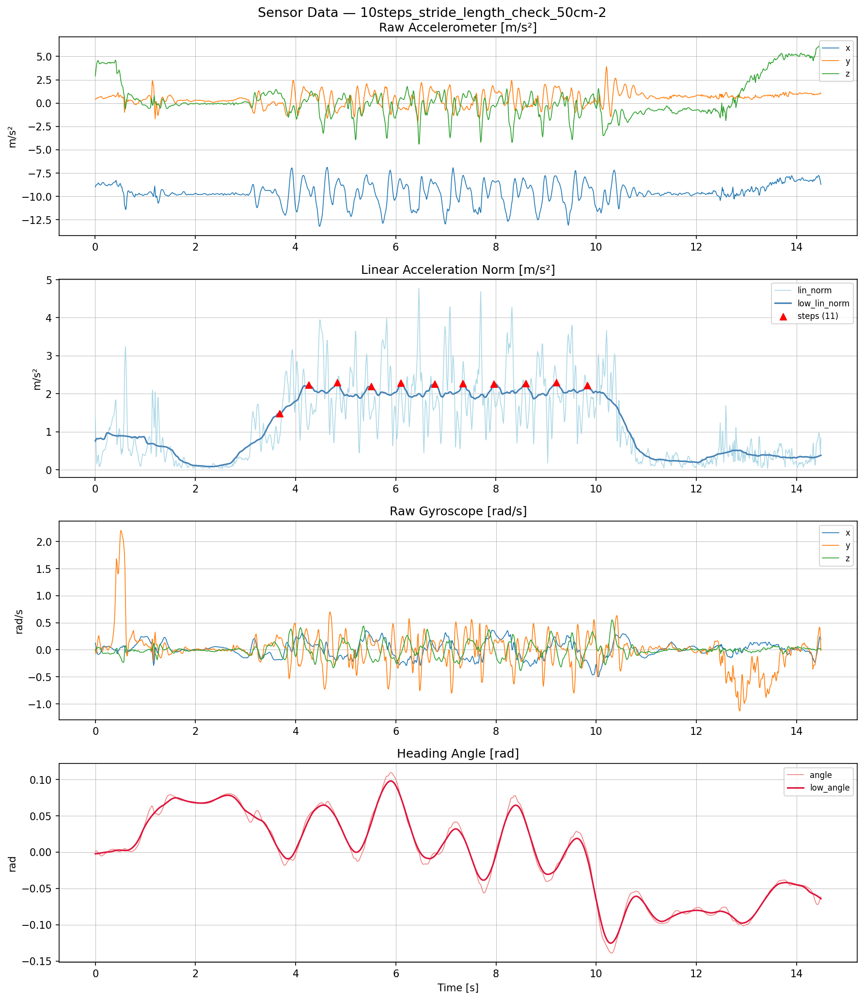
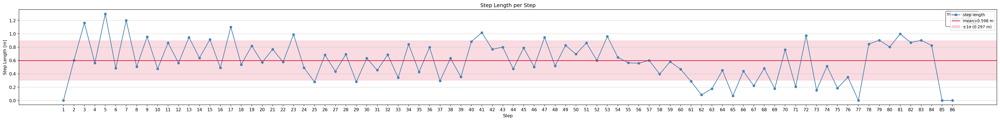

# rikka

スマートフォンのセンサーデータ（加速度計・ジャイロスコープ）から歩行軌跡を推定する PDR（Pedestrian Dead Reckoning）ライブラリです。

---

## セットアップ

```sh
uv sync --all-groups
```

MP4 アニメーション出力（`uv run rikka particle`）には ffmpeg が必要です。

```sh
brew install ffmpeg
```

---

## 使い方

### 入力データの配置

`input/<データフォルダ>/` に以下の2ファイルを置きます（phyphox 形式の CSV）。

```
input/
└── my_walk/
    ├── Accelerometer.csv
    └── Gyroscope.csv
```

各 CSV の列構成は次のとおりです（phyphox アプリの出力形式）。

| ファイル | 列 |
|---|---|
| `Accelerometer.csv` | `Time (s)`, `Acceleration x (m/s^2)`, `Acceleration y (m/s^2)`, `Acceleration z (m/s^2)` |
| `Gyroscope.csv` | `Time (s)`, `Gyroscope x (rad/s)`, `Gyroscope y (rad/s)`, `Gyroscope z (rad/s)` |

列名が `X (m/s^2)` / `X (rad/s)` 形式の場合も自動で対応します。

`src/rikka/config.py` の `DATA_DIR` を対象フォルダに変更します。

```python
DATA_DIR = "input/my_walk"
```

---

### 実行コマンド

#### 通常の PDR 軌跡推定

```sh
uv run rikka run [OPTIONS]

# 例: フロアマップと起点を変更して実行
uv run rikka run -f input/map.png --origin-px 1000 500 --no-plot
```

- 軌跡グラフ（`trajectory.png`）と歩幅グラフ（`step_lengths.png`）、CSV を `output/<timestamp>/` に保存します。

#### PDR 軌跡推定（run の別名）

```sh
uv run rikka pdr [OPTIONS]
```

- `run` と同じ処理・オプションです。

#### パーティクルフィルタ付き軌跡推定

```sh
uv run rikka particle
```

- マップマッチングでパーティクルを通路内に収束させながら軌跡を推定します。
- `pf_trajectory.png`・`step_lengths.png`・`particle_filter.mp4`（または `.gif`）を出力します。
- MP4 出力には `ffmpeg` が必要です（`brew install ffmpeg`）。

#### センサーデータの可視化

```sh
uv run rikka sensor
```

- 生加速度・線形加速度ノルム・ジャイロ・積算角度を4段グラフにして `input/<データフォルダ>/sensor_plot.png` に保存します。



---

### 歩幅グラフ（`step_lengths.png`）

`uv run rikka` / `uv run rikka particle` 実行時に自動生成されます。

- 折れ線グラフ：各ステップの歩幅 [m]
- 赤い水平線：平均値
- 赤い半透明帯：±1σ 範囲（σ = 標準偏差。帯の幅が狭いほど歩幅が安定していることを示す）
- 右上テキスト・コンソール出力：`mean / std / n`



---

### Python から直接使う

CSV 以外のソース（リアルタイム取得・前処理済みデータなど）から DataFrame を用意して渡すこともできます。

```python
import pandas as pd
from rikka.analyze.pdr import run

df_acc = pd.DataFrame(...)   # 列: t, x, y, z
df_gyro = pd.DataFrame(...)  # 列: t, x, y, z

# 通常の PDR
trajectory = run(df_acc=df_acc, df_gyro=df_gyro)

# パーティクルフィルタ
trajectory = run(df_acc=df_acc, df_gyro=df_gyro, use_particle_filter=True)

# グラフ非表示（バッチ処理向け）
trajectory = run(df_acc=df_acc, df_gyro=df_gyro, plot=False)

# フロアマップを外部から指定
trajectory = run(
    df_acc=df_acc,
    df_gyro=df_gyro,
    floormap_path="path/to/floormap.png",
    origin_px=(1000, 500),
    scale=0.01,
    initial_direction=90.0,
)
```

`df_acc` と `df_gyro` は両方渡すか、両方省略（CSV から自動読み込み）してください。片方だけ渡すと `ValueError` になります。

---

### 主な設定項目（`src/rikka/config.py`）

| 設定名 | 説明 | 既定値 |
|---|---|---|
| `DATA_DIR` | 入力データフォルダのパス | `"input/..."` |
| `FLOORMAP_PATH` | フロアマップ画像のパス | `"input/Floormap_building14_5floor.png"` |
| `FLOORMAP_ORIGIN_PX` | 軌跡起点のピクセル座標 `(x, y)` | `(2050, 700)` |
| `FLOORMAP_SCALE` | 1ピクセルあたりのメートル数 | `0.01`（1px = 1cm） |
| `INITIAL_DIRECTION` | 歩行開始方向のオフセット [度] | `90.0` |
| `STEP_LENGTH_METHOD` | 歩幅推定手法 `"weinberg"` or `"forward"` | `"forward"` |
| `WEINBERG_K` | Weinberg モデルのスケール係数 | `0.47` |
| `PF_NUM_PARTICLES` | パーティクル数 | `500` |
| `PF_SIGMA_HEADING` | ステップごとの方位角ノイズ [rad] | `0.2` |

---

## 開発コマンド

### フォーマット

```sh
uv run ruff format
```

### リント

```sh
uv run ruff check
# 自動修正
uv run ruff check --fix
```

### 型チェック

```sh
uv run mypy src/
```

### テスト

```sh
uv run pytest
```

---

## コミット前の設定

`git commit` 時に自動フォーマットを反映したい場合、最初に hook を有効化します。

```sh
git config core.hooksPath .githooks
```

---

## CI が落ちたら

```sh
uv run pre-commit run --all-files
```

自動修正された変更を push するだけで解決するケースがほとんどです。
