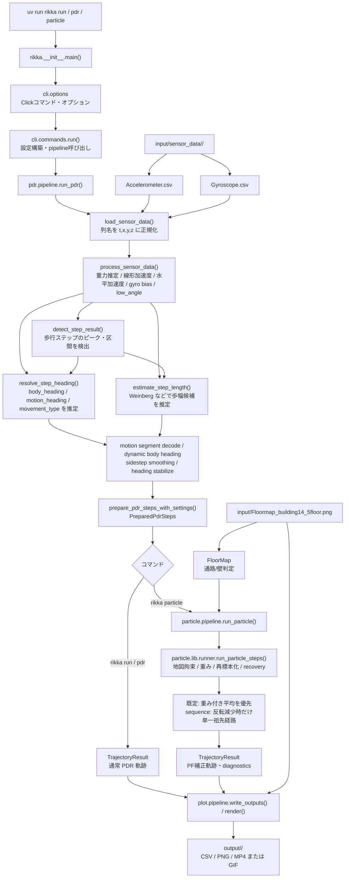
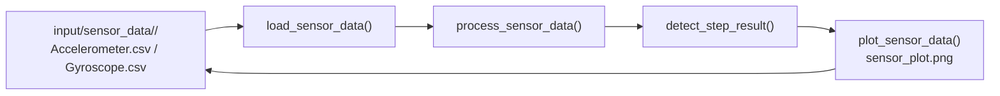

# rikka

スマートフォンの加速度計・ジャイロスコープ CSV から歩行軌跡を推定する
PDR（Pedestrian Dead Reckoning）ライブラリです。

現在の標準設定は、ジャイロの端末方位と水平加速度の移動軸を分離する
`gyro_accel_motion` です。横歩きを連続区間で復号し、安定区間から端末と身体の
時変方位差を推定します。通常歩行は補正後の `body_heading`、確定横歩きは
`motion_heading` を使い、端末だけを曲げた量が進行方向へ直接入らないようにしています。
確定しなかった単発候補は前進扱いにします。

## セットアップ

```sh
uv sync --all-groups
```

AI エージェントや sandbox 環境で `uv` の既定キャッシュに対する権限エラーが
発生した場合に限り、リポジトリ内キャッシュを使って再実行します。

```sh
UV_CACHE_DIR=.uv-cache uv run pytest
```

パーティクルフィルタの MP4 アニメーション出力には `ffmpeg` が必要です。

```sh
brew install ffmpeg
```

## 入力データ

`input/sensor_data/<人名>/<データフォルダ>/` に phyphox 形式の CSV を置きます。
正解経路の動画・CSV・画像は `input/correct_path/<経路フォルダ>/` に分けて
配置します。フロアマップ画像は `input/` 直下に置きます。

```text
input/
├── sensor_data/
│   └── natsuki/
│       └── my_walk/
│           ├── Accelerometer.csv
│           └── Gyroscope.csv
├── correct_path/
│   └── my_walk/
│       └── walk_trace.csv
└── Floormap_building14_5floor.png
```

対応する列名は次の通りです。

| ファイル | 対応列 |
|---|---|
| `Accelerometer.csv` | `Time (s)`, `Acceleration x/y/z (m/s^2)` または `X/Y/Z (m/s^2)` |
| `Gyroscope.csv` | `Time (s)`, `Gyroscope x/y/z (rad/s)` または `X/Y/Z (rad/s)` |

現在の既定入力は次です。

```python
DATA_DIR = "input/sensor_data/hiroto/hiroto_1turn_rightsidestep_3turn_leftsidestep"
```

別データを使う場合は、CLI の `-d` で指定できます。

```sh
uv run rikka run -d input/sensor_data/natsuki/my_walk
```

## 基本コマンド

標準設定で通常 PDR を実行します。プロット表示と PNG/CSV 保存を行います。

```sh
uv run rikka run
```

プロット表示を止めてバッチ確認する場合だけ `--no-plot` を付けます。

```sh
uv run rikka run --no-plot
```

`pdr` は `run` の別名です。

```sh
uv run rikka pdr
```

パーティクルフィルタ付きで実行します。

```sh
uv run rikka particle
```

グラフ表示なしでパーティクルフィルタのアニメーションだけ保存する場合:

```sh
uv run rikka particle --no-plot --save-animation
```

問題歩の粒子状態と代表軌跡候補を静止画で確認する場合:

```sh
uv run rikka particle --no-plot --pf-seed 10 \
  --save-step-frames --step-frames-range 70 85 \
  --save-path-comparison
```

段階別画像は既定で無効です。`--step-frames-arrows` で方位矢印数、
`--step-frames-dpi` で解像度を調整できます。

センサー波形を確認します。入力フォルダに `sensor_plot.png` を保存します。
同名ファイルがある場合は、`sensor_plot_001.png` のように連番を付けて保存します。

```sh
uv run rikka sensor
```

## BLE ランドマーク補正

既知座標に置いた BLE ビーコンの RSSI が閾値以上になったとき、通常 PDR の位置を
ランドマーク座標へ補正できます。既定では無効で、particle filter には適用しません。

実測データがない場合は、センサー CSV と同じ時間軸のサンプルを先に生成します。

```sh
uv run rikka ble-sample
uv run rikka run --ble-landmark --no-plot
```

BLE CSV は次の3列を持ちます。

| 列 | 内容 |
|---|---|
| `timestamp_s` | phyphox の実験開始からの経過秒 |
| `beacon_id` | `BLE_LANDMARKS` に登録するビーコン識別子 |
| `rssi_dbm` | 受信 RSSI [dBm] |

ランドマーク座標は `src/rikka/common/config/__init__.py` の `BLE_LANDMARKS` に
`(beacon_id, x_m, y_m)` で設定します。既定の検出下限は -55 dBm です。

- `--ble-landmark`: BLE 補正を有効化
- `--ble-data PATH`: BLE CSV を指定
- `--ble-rssi-threshold DBM`: 検出下限を変更

実測値へ差し替える場合は、同じ3列と経過秒の時間軸へ整形し、
`--ble-data <実測CSV>` を指定します。絶対時刻だけの場合は、phyphox の
`meta/time.csv` にある START の `system time` を引いて経過秒へ変換してください。

BLE 有効時は `output/<timestamp>/landmark_corrections.csv` に検出時刻、RSSI、
補正前座標、ランドマーク座標、補正後座標を保存します。`trajectory.png` には
補正前後の軌跡、ランドマーク、補正地点を重ねて描画します。
最終歩より後で補正できなかった検出は `step=-1`、`applied=False` としてCSVに残ります。

`rikka particle --ble-landmark` は警告を表示し、最終的な PF 軌跡には BLE 補正を
適用しません。PF へ統合する場合は、座標上書きではなく観測尤度として別途設計します。

## データフロー

`rikka.__init__.main()` から Click の `cli.options` に入り、
`cli.commands.run()` が設定の組み立てと各 pipeline の呼び出しを担当します。
`run` / `pdr` / `particle` は、同じ CSV 読み込みと PDR ステップ準備を通ります。
通常 PDR はそのステップ列をそのまま軌跡へ積み上げ、particle filter は同じ
`PreparedPdrSteps` をフロアマップ制約で補正します。最後に `plot.pipeline` が
CSV・画像・アニメーションを出力します。


```mermaid
flowchart TD
    command["uv run rikka run / pdr / particle"] --> entry["rikka.__init__.main()"]
    entry --> cli_options["cli.options\nClickコマンド・オプション"]
    cli_options --> cli_run["cli.commands.run()\n設定構築・pipeline呼び出し"]

    input_dir["input/sensor_data/<data_dir>/"] --> acc_csv["Accelerometer.csv"]
    input_dir --> gyro_csv["Gyroscope.csv"]

    cli_run --> pdr_pipeline["pdr.pipeline.run_pdr()"]
    pdr_pipeline --> load["load_sensor_data()\n列名を t,x,y,z に正規化"]
    acc_csv --> load
    gyro_csv --> load
    load --> preprocess["process_sensor_data()\n重力推定 / 線形加速度 / 水平加速度 / gyro bias / low_angle"]

    preprocess --> step_detect["detect_step_result()\n歩行ステップのピーク・区間を検出"]
    preprocess --> heading["resolve_step_heading()\nbody_heading / motion_heading / movement_type を推定"]
    step_detect --> heading
    preprocess --> step_length["estimate_step_length()\nWeinberg などで歩幅候補を推定"]
    step_detect --> step_length
    heading --> sidestep["motion segment decode / dynamic body heading\nsidestep smoothing / heading stabilize"]
    step_length --> sidestep
    sidestep --> prepared["prepare_pdr_steps_with_settings()\nPreparedPdrSteps"]

    prepared --> pdr_branch{"コマンド"}
    pdr_branch -->|rikka run / pdr| det_traj["TrajectoryResult\n通常 PDR 軌跡"]
    pdr_branch -->|rikka particle| particle_pipeline["particle.pipeline.run_particle()"]
    particle_pipeline --> pf["particle.lib.runner.run_particle_steps()\n地図拘束 / 重み / 再標本化 / recovery"]

    floormap["input/Floormap_building14_5floor.png"] --> pf_map["FloorMap\n通路/壁判定"]
    pf_map --> particle_pipeline
    pf --> pf_path["既定: 重み付き平均を優先\nsequence: 反転減少時だけ単一祖先経路"]

    det_traj --> plot_pipeline["plot.pipeline.write_outputs() / render()"]
    pf_path --> pf_result["TrajectoryResult\nPF補正軌跡・diagnostics"]
    pf_result --> plot_pipeline
    floormap --> plot_pipeline
    plot_pipeline --> output_dir["output/<timestamp>/\nCSV / PNG / MP4 または GIF"]
```

センサー波形だけを確認する `sensor` コマンドは、軌跡推定までは進まず、
前処理とステップ検出結果を入力フォルダ内の画像へ保存します。


```mermaid
flowchart LR
    input["input/sensor_data/<data_dir>/\nAccelerometer.csv / Gyroscope.csv"] --> load["load_sensor_data()"]
    load --> preprocess["process_sensor_data()"]
    preprocess --> detect["detect_step_result()"]
    detect --> sensor_plot["plot_sensor_data()\nsensor_plot.png"]
    sensor_plot --> input
```

## 標準設定

`uv run rikka run` の現在の主要な既定値です。

| 項目 | 既定値 | 説明 |
|---|---:|---|
| `DATA_DIR` | `input/sensor_data/hiroto/hiroto_1turn_rightsidestep_3turn_leftsidestep` | 入力データ |
| `FLOORMAP_PATH` | `input/Floormap_building14_5floor.png` | 背景マップ |
| `FLOORMAP_ORIGIN_PX` | `(2050, 400)` | 軌跡の開始ピクセル |
| `FLOORMAP_SCALE` | `0.01` | 1px あたりのメートル数 |
| `INITIAL_DIRECTION` | `90.0` | 歩行開始方向 [deg] |
| `STEP_DETECTION_METHOD` | `peak` | ステップ検出 |
| `HEADING_METHOD` | `gyro_accel_motion` | 方位・移動方向推定 |
| `FORWARD_HEADING_SOURCE` | `body` | 通常歩行はジャイロ由来の体・端末方向を使用 |
| `GYRO_BIAS_METHOD` | `prewalk_guarded` | 小さい歩行前biasだけを採用し、端末回転の誤認を抑制 |
| `USER_HEIGHT_M` | `1.68` | Weinberg 歩幅補正用の身長 |
| `SIDESTEP_LATERAL_RATIO` | `1.2` | 横方向/前方向の比率がこの値以上で横歩き候補 |
| `SIDESTEP_MIN_LATERAL_DISPLACEMENT_M` | `0.03` | 横歩き判定に必要な横方向変位 [m] |
| `SIDESTEP_SMOOTHING_METHOD` | `clustered` | 同方向 evidence の連続クラスタを評価し、確定横歩きまたは横歩き疑いとして軌跡へ反映 |
| `SIDESTEP_LENGTH_SCALE` | `0.8` | 横歩き歩幅の倍率 |
| `TURNING_LENGTH_SCALE` | `0.3` | 旋回中歩幅の倍率 |
| `MOTION_ESTIMATION` | `adaptive` | 運動状態・方位・歩幅を確率状態として逐次推定 |
| `SMOOTHING_MODE` | `causal` | 各歩までの観測だけを使う因果推定 |
| `PF_HEADING_DRIFT_RETENTION` | `0.85` | PFの通常方位ドリフトを次歩へ保持する割合 |
| `PF_SIGMA_INIT_HEADING` | `0.03` | PFの初期方位ばらつき [rad] |
| `PF_SIGMA_HEADING` | `0.01` | PFの1歩ごとの方位ノイズ [rad] |
| `PF_SIGMA_STEP_LENGTH_RATIO` | `0.01` | 永続倍率で説明できない1歩ごとの歩幅ノイズ |
| `PF_STRIDE_SCALE_PRIOR_MEAN` | `1.03` | 正解軌跡長から校正したPF歩幅倍率の事前中心 |
| `PF_STRIDE_SCALE_RETENTION` | `0.995` | 学習した歩幅倍率偏差を次歩へ保持する割合 |
| `PF_STRIDE_SCALE_MIN / MAX` | `0.90 / 1.15` | PFが保持する歩幅倍率の範囲 |
| `PF_RESAMPLE_ESS_RATIO` | `0.5` | PFで再標本化を開始するESS比率 |
| `PF_REJUVENATION_SIGMA_HEADING` | `0.009` | 再標本化後に加える適応方位ノイズの上限 [rad] |
| `PF_RECOVERY_VALID_RATIO` | `0.05` | PFでmap-aware recoveryを開始する有効粒子率 |
| `PF_MOTION_PREDICTIVE_WEIGHT_POWER` | `0.1` | 運動状態予測尤度を弱くPF重みへ反映する指数 |
| `PF_PATH_SELECTION` | `sequence` | 持続反転が減る場合だけ単一祖先経路を採用 |

`gyro_accel_motion` では次を分けて扱います。

- `body_heading`: ジャイロから推定した体/端末の向き
- `motion_heading`: 水平加速度から推定した1歩ごとの移動方向特徴
- `movement_type`: センサー上の判定結果
- `trajectory_movement_type`: 軌跡計算に使った移動タイプ
- `forward_heading_source`: `forward` 判定ステップの軌跡方位ソース

## 横歩き判定の見方

実行後、`output/<timestamp>/step_headings.csv` を確認します。

重要な列は次です。

| 列 | 意味 |
|---|---|
| `movement_type` | センサー上の判定。`sidestep_left/right` なら横歩きとして検出済み |
| `trajectory_movement_type` | 軌跡に反映した移動タイプ。`forward` なら検出は横歩きだが軌跡上は前進扱い |
| `body_heading_deg` | 体/端末の向き |
| `motion_heading_deg` | 水平加速度から見た移動方向 |
| `selected_heading_deg` | 実際に軌跡へ使った方位 |
| `forward_heading_source` | `forward` 判定ステップの軌跡方位ソース |
| `lateral_forward_ratio` | 横方向変位 / 前方向変位 |
| `forward_displacement` | 体方向への変位特徴 |
| `lateral_displacement` | 横方向への変位特徴 |
| `motion_heading_correction_deg` | 水平加速度方向の補正角 |
| `decoded_motion_mode` | 区間復号した `forward / sidestep_left / sidestep_right` |
| `device_body_offset_deg` | 歩ごとに推定した端末−身体方位差 |
| `body_heading_update_reason` | 動的方位を更新したか、更新を止めた理由 |

標準設定の `clustered` では、同方向の横歩き evidence が連続する区間をクラスタとして
評価します。条件を満たす1歩の隙間は最大1つまでクラスタに含め、横歩き evidence が
2歩以上かつクラスタ全体の横方向変位が閾値を満たす場合、確定横歩きとして軌跡へ
反映します。

確定しなかった強い単発 evidence は、標準の `--sidestep-suspect-mode forward` では
`trajectory_movement_type="forward"`として前進扱いにします。
また、`forward`判定ステップはジャイロ由来の`body_heading`で軌跡へ積みます。
比較のため水平加速度由来の`motion_heading`で積む場合は次を指定します。

```sh
uv run rikka run --forward-heading-source motion
```

正解軌跡との複数seed比較を実行する場合:

```sh
MPLBACKEND=Agg uv run python \
  agent/agent_evaluate_pf_ground_truth.py \
  --plot-path output/diagnostics/pf_ground_truth_comparison.png
```

運動状態・方位・歩幅を確率状態として逐次推定する標準モードは次のように実行する。
`causal` は各歩までの観測だけを使い、`offline` は記録全体を使って運動状態列を
後向き平滑化する。標準設定は `adaptive + causal` である。

```sh
uv run rikka run
uv run rikka particle --pf-seed 42
uv run rikka particle --motion-estimation adaptive --smoothing offline --pf-seed 42
uv run rikka run --motion-estimation robust --smoothing causal
```

運動状態の予測尤度は、5記録・6 seed評価で最も安定した指数 `0.1` を標準値として
弱くPF重みへ反映する。
中央値を優先する場合は `offline`、最悪seedのRMSEを優先する場合は `causal` が
今回の評価では良かった。

```sh
uv run rikka particle --motion-estimation adaptive \
  --motion-predictive-weight-power 0.1 \
  --pf-path-selection sequence --pf-particles 500 --pf-seed 42
```

粒子数の既定値は `rikka.common.config` の `PF_NUM_PARTICLES` で設定します。実行単位で
変更する場合はCLIの `--pf-particles`、Python APIの `particle_count` を使います。

`robust` は移動軸の180度方向曖昧性を区間で解決する実験方式である。5反復計測では
一部データを改善した一方で中央値を悪化させたため、既定や推奨へは昇格していない。
`sequence` は反転が実際に減る場合だけ単一粒子の完全な祖先経路を使い、それ以外は
到達可能な平均経路へ戻る標準設定である。

単一計測では、方位ドリフト後に地図上の対称な分岐へ到達すると、壁交差がなくても
逆側の廊下へ収束し、単一PFだけでは一意に直せない場合がある。
複数計測の代表軌跡を作るときは、終端15%の方向を
計測・PDR/PF方式ごとに等重みで比較し、多数方向から90度を超えて外れる候補を除外
してからmedoidを選ぶ。正解軌跡はこの選択には使用せず、選択後の評価だけに使う。

評価CSV/JSONでは次も確認する。

- `terminal_direction_error_deg`: 正解終端区間との方位差
- `terminal_progress_cosine`: 正解終端方向への投影。負なら逆向き
- `terminal_opposed_fraction`: 終端15%で対応接線が90度以上逆向きの割合
- `terminal_direction_failure`: projectionが負、または逆向き割合が0.5以上

通常PDRの方式比較は、同じ正解ルートに対応するデータをまとめて指定できる。

```sh
MPLBACKEND=Agg uv run python agent/agent_evaluate_adaptive_pdr.py \
  --data-dir \
  input/sensor_data/natsuki/1turn_rightsidestep_3turn_leftsidestep \
  input/sensor_data/natsuki/1turn_rightsidestep_3turn_leftsidestep5 \
  input/sensor_data/natsuki/1turn_rightsidestep_3turn_leftsidestep6 \
  input/sensor_data/natsuki/1turn_rightsidestep_3turn_leftsidestep7 \
  input/sensor_data/natsuki/1turn_rightsidestep_3turn_leftsidestep8
```

横歩き判定を軌跡へそのまま反映して比較したい場合:

```sh
uv run rikka run --sidestep-smoothing none
```

旧方式の単発横歩き抑制と比較したい場合:

```sh
uv run rikka run --sidestep-smoothing isolated
```

横歩き判定を増やす/減らす場合:

```sh
# 拾いやすくする
uv run rikka run --sidestep-lateral-ratio 1.0

# 厳しくする
uv run rikka run --sidestep-lateral-ratio 1.5
```

## ジャイロバイアス比較

定速の端末回転を静止中のbiasと誤認すると、全区間へ誤った補正が入り軌跡が
曲がり続けます。そのため標準の `prewalk_guarded` は、推定値が±0.003 rad/s以内の
場合だけ採用し、それを超える場合は0へ戻します。記録前後に確実な静止区間を
用意できる場合は `prewalk_robust`、補正しない比較には `zero`、既知の校正値が
ある場合は `manual` も使用できます。

```sh
uv run rikka run \
  -d input/sensor_data/natsuki/1turn_rightsidestep_3turn_leftsidestep2 \
  --gyro-bias-method manual \
  --gyro-bias 0.002
```

## 主な出力

通常 PDR は `output/<timestamp>/` に保存します。

| ファイル | 内容 |
|---|---|
| `trajectory.csv` | 移動後座標。列は `timestamp_s,x,y` |
| `trajectory.png` | フロアマップ上の軌跡 |
| `step_lengths.csv` | ステップごとの歩幅 |
| `step_length_observations.csv` | 1歩区間の歩幅候補、周期、振幅、品質、不確かさ |
| `motion_posteriors.csv` | adaptive時の運動状態確率、方位・歩幅・端末姿勢ずれの事後分布 |
| `direction_posteriors.csv` | robust時の移動軸2方向の確率、採用方位、反転根拠 |
| `step_lengths.png` | 歩幅グラフ |
| `step_vectors.csv` | ステップごとの変位ベクトル |
| `step_vectors/step_*.png` | 各ステップの変位と加速度分布 |
| `step_headings.csv` | 方位候補、横歩き判定、軌跡反映タイプ |
| `gyro_bias.csv` | ジャイロバイアス推定の診断情報 |
| `step_segments.csv` | `paper_vertical_threshold` 使用時のステップ区間 |

パーティクルフィルタでは追加で次を保存します。

| ファイル | 内容 |
|---|---|
| `pf_trajectory.png` | PF の平均優先、または反転抑制された単一祖先軌跡 |
| `particle_diagnostics.csv` | 各歩のESS、有効粒子数、位置・方位分散、歩幅倍率、recovery、軌跡選択モード |
| `particle_filter.mp4` / `.gif` | パーティクル分布アニメーション |
| `particle_frames/step_*.png` | 明示保存時の開始・提案・壁判定・重み・選択/復旧・確定と方位ローズ |
| `particle_paths_comparison.png` | 明示保存時の加重平均・単一祖先・個別粒子経路と方位変化の比較 |

## コード構成

公開エントリポイントと CLI をアダプターとして、実装は
`common / pdr / particle / plot` の4領域に分割されています。

| ファイル | 役割 |
|---|---|
| `__init__.py` | `main()` と公開APIのエントリポイント |
| `cli/options.py` | ClickコマンドとCLIオプションの定義 |
| `cli/commands.py` | 入力読込、設定構築、PDR・PF・出力pipelineの接続 |
| `common/config/`, `common/settings.py` | 定数と検証済み設定 |
| `common/lib/models.py` | `PreparedPdrSteps`、`TrajectoryResult` などの共有型 |
| `pdr/pipeline.py` | センサー入力から通常PDR結果までの手順 |
| `pdr/lib/` | 歩検出、歩幅、方位、運動状態、積分、fusion |
| `particle/pipeline.py` | 準備済み歩列へ地図拘束を適用する手順 |
| `particle/lib/` | 提案、地図拘束、重み、再標本化、復旧、経路、記録 |
| `plot/pipeline.py` | CSV・図・animationの出力手順 |
| `plot/lib/` | フロアマップ座標変換と個別成果物 |

`particle.pipeline.run_particle()` は `prepare_pdr_steps_with_settings()` が作った
`PreparedPdrSteps` を境界として受け取り、フロアマップ制約で軌跡を補正します。
低水準のPF段階実行は `particle.lib.runner.run_particle_steps()` が担当します。

関数単位の読み順、設定、入出力、通常PDRとPFの分岐は、
[コードリード資料](docs/code-reading/README.md) にまとめています。

## Python から使う

```python
import pandas as pd
from rikka.cli.commands import run

df_acc = pd.DataFrame(...)   # 列: t, x, y, z
df_gyro = pd.DataFrame(...)  # 列: t, x, y, z

trajectory_df = run(df_acc=df_acc, df_gyro=df_gyro)
```

`df_acc` と `df_gyro` は両方渡すか、両方省略してください。片方だけ渡すと
`ValueError` になります。戻り値は `timestamp_s`, `x`, `y` 列を持つ
`pandas.DataFrame` です。APIから呼んだ場合も `output/<timestamp>/` を作成し、
CSVと、設定に応じた画像・アニメーションを保存します。

区間復号・動的身体方位と従来clusterをAPIで比較する場合は、
`prepare_pdr_steps(..., motion_refinement=False)` で従来処理を実行できます。

グラフを表示しない場合:

```python
trajectory_df = run(df_acc=df_acc, df_gyro=df_gyro, plot=False)
```

パーティクルフィルタを使う場合:

```python
trajectory_df = run(
    df_acc=df_acc,
    df_gyro=df_gyro,
    use_particle_filter=True,
    particle_count=500,
    save_step_frames=True,
    step_frames_range=(70, 85),
    save_path_comparison=True,
)
```

## 開発コマンド

```sh
uv run ruff format
uv run ruff check
uv run mypy src/
uv run pytest
uv build
```

CI と同等の pre-commit チェック:

```sh
uv run pre-commit run --all-files
```

リポジトリ管理の Git hook を使う場合:

```sh
git config core.hooksPath .githooks
```

## 接続確認

```python
from rikka import ping

print(ping())  # Hello, rikka
```


