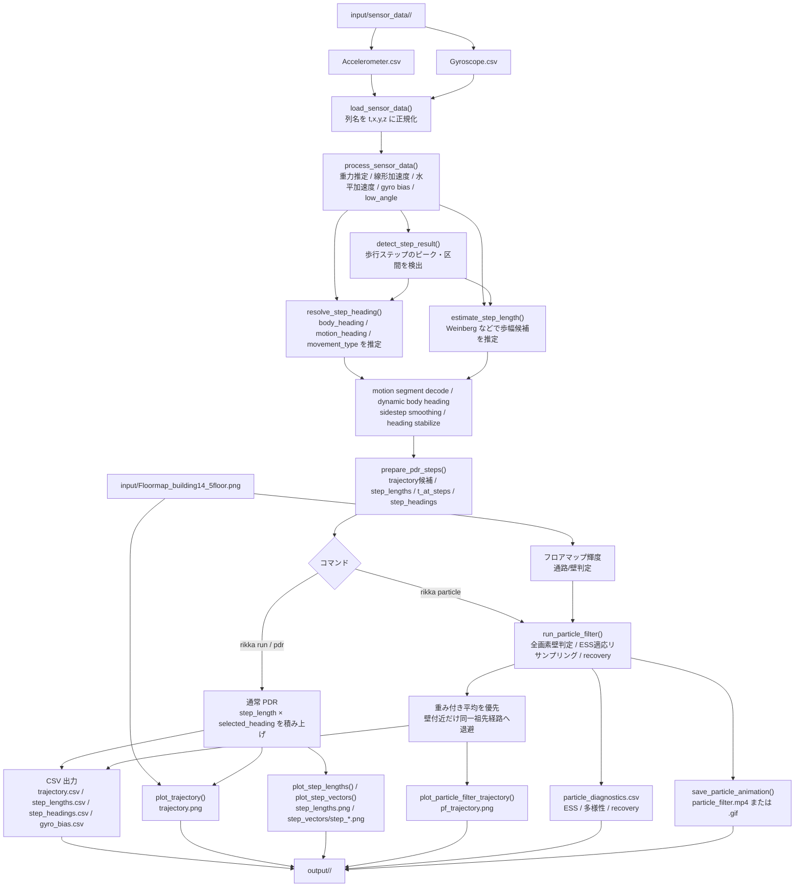
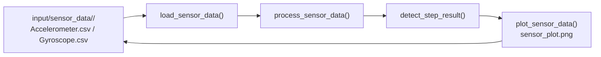
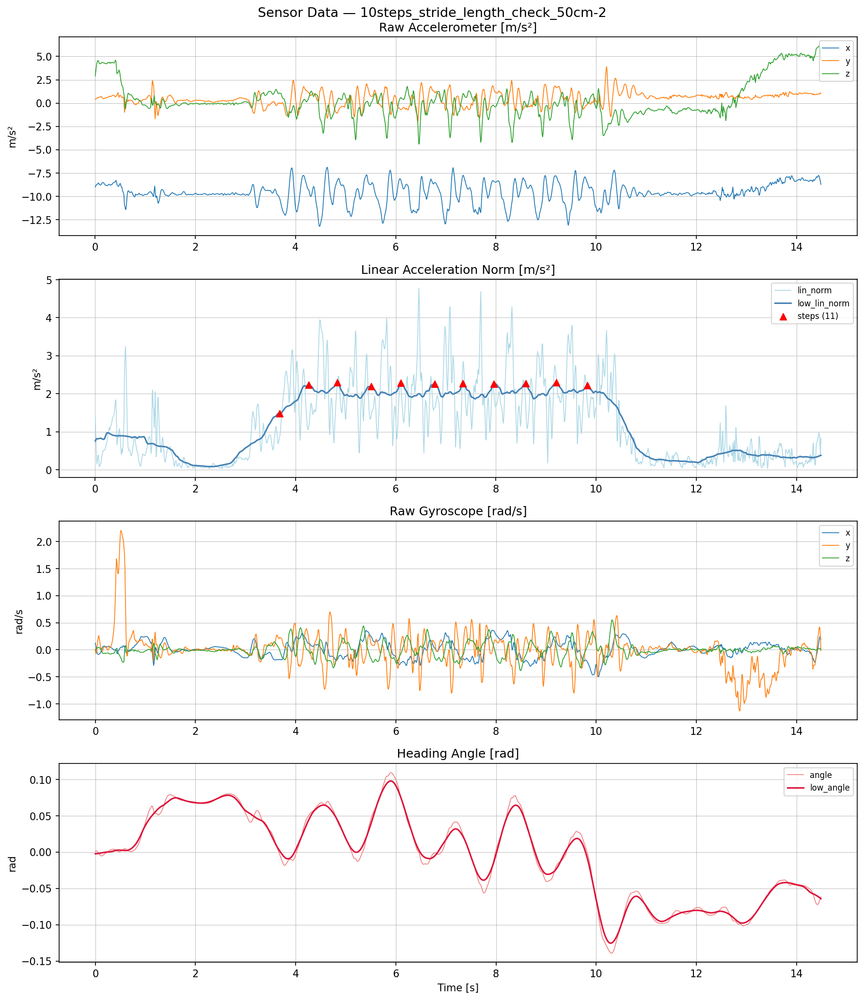
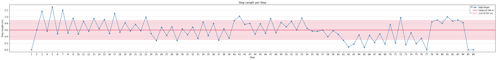

# rikka

スマートフォンの加速度計・ジャイロスコープ CSV から歩行軌跡を推定する
PDR（Pedestrian Dead Reckoning）ライブラリです。

現在の標準設定は、ジャイロの端末方位と水平加速度の移動軸を分離する
`gyro_accel_motion` です。横歩きを連続区間で復号し、安定区間から端末と身体の
時変方位差を推定します。通常歩行は補正後の `body_heading`、確定横歩きは
`motion_heading` を使い、端末だけを曲げた量が進行方向へ直接入らないようにしています。
確定しなかった単発候補は前進扱いにします。

## セットアップ

```sh
uv sync --all-groups
```

AI エージェントや sandbox 環境で `uv` の既定キャッシュに対する権限エラーが
発生した場合に限り、リポジトリ内キャッシュを使って再実行します。

```sh
UV_CACHE_DIR=.uv-cache uv run pytest
```

パーティクルフィルタの MP4 アニメーション出力には `ffmpeg` が必要です。

```sh
brew install ffmpeg
```

## 入力データ

`input/sensor_data/<データフォルダ>/` に phyphox 形式の CSV を置きます。
正解経路の動画・CSV・画像は `input/correct_path/<経路フォルダ>/` に分けて
配置します。フロアマップ画像は `input/` 直下に置きます。

```text
input/
├── sensor_data/
│   └── my_walk/
│       ├── Accelerometer.csv
│       └── Gyroscope.csv
├── correct_path/
│   └── my_walk/
│       └── walk_trace.csv
└── Floormap_building14_5floor.png
```

対応する列名は次の通りです。

| ファイル | 対応列 |
|---|---|
| `Accelerometer.csv` | `Time (s)`, `Acceleration x/y/z (m/s^2)` または `X/Y/Z (m/s^2)` |
| `Gyroscope.csv` | `Time (s)`, `Gyroscope x/y/z (rad/s)` または `X/Y/Z (rad/s)` |

現在の既定入力は次です。

```python
DATA_DIR = "input/sensor_data/1turn_rightsidestep_3turn_leftsidestep5"
```

別データを使う場合は、CLI の `-d` で指定できます。

```sh
uv run rikka run -d input/sensor_data/my_walk
```

## 基本コマンド

標準設定で通常 PDR を実行します。プロット表示と PNG/CSV 保存を行います。

```sh
uv run rikka run
```

プロット表示を止めてバッチ確認する場合だけ `--no-plot` を付けます。

```sh
uv run rikka run --no-plot
```

`pdr` は `run` の別名です。

```sh
uv run rikka pdr
```

パーティクルフィルタ付きで実行します。

```sh
uv run rikka particle
```

グラフ表示なしでパーティクルフィルタのアニメーションだけ保存する場合:

```sh
uv run rikka particle --no-plot --save-animation
```

センサー波形を確認します。入力フォルダに `sensor_plot.png` を保存します。

```sh
uv run rikka sensor
```

## データフロー

`run` / `pdr` / `particle` は、同じ CSV 読み込みと PDR ステップ準備を通ります。
通常 PDR はそのステップ列をそのまま軌跡へ積み上げ、particle filter は同じステップ列を
フロアマップ制約で補正してから画像やアニメーションへ出力します。


```mermaid
flowchart TD
    input_dir["input/sensor_data/<data_dir>/"] --> acc_csv["Accelerometer.csv"]
    input_dir --> gyro_csv["Gyroscope.csv"]
    floormap["input/Floormap_building14_5floor.png"] --> plot_pdr
    floormap --> pf_map

    acc_csv --> load["load_sensor_data()\n列名を t,x,y,z に正規化"]
    gyro_csv --> load
    load --> preprocess["process_sensor_data()\n重力推定 / 線形加速度 / 水平加速度 / gyro bias / low_angle"]

    preprocess --> step_detect["detect_step_result()\n歩行ステップのピーク・区間を検出"]
    preprocess --> heading["resolve_step_heading()\nbody_heading / motion_heading / movement_type を推定"]
    step_detect --> heading
    preprocess --> step_length["estimate_step_length()\nWeinberg などで歩幅候補を推定"]
    step_detect --> step_length
    heading --> sidestep["motion segment decode / dynamic body heading\nsidestep smoothing / heading stabilize"]
    step_length --> sidestep
    sidestep --> prepared["prepare_pdr_steps()\ntrajectory候補 / step_lengths / t_at_steps / step_headings"]

    prepared --> pdr_branch{"コマンド"}
    pdr_branch -->|rikka run / pdr| det_traj["通常 PDR\nstep_length × selected_heading を積み上げ"]
    pdr_branch -->|rikka particle| pf["run_particle_filter()\n全画素壁判定 / ESS適応リサンプリング / recovery"]

    pf_map["フロアマップ輝度\n通路/壁判定"] --> pf
    pf --> pf_path["重み付き平均を優先\n壁付近だけ同一祖先経路へ退避"]

    det_traj --> csv_common["CSV 出力\ntrajectory.csv / step_lengths.csv / step_headings.csv / gyro_bias.csv"]
    det_traj --> plot_pdr["plot_trajectory()\ntrajectory.png"]
    det_traj --> step_plots["plot_step_lengths() / plot_step_vectors()\nstep_lengths.png / step_vectors/step_*.png"]

    pf_path --> csv_common
    pf_path --> plot_pf["plot_particle_filter_trajectory()\npf_trajectory.png"]
    pf --> pf_diagnostics["particle_diagnostics.csv\nESS / 多様性 / recovery"]
    pf --> anim["save_particle_animation()\nparticle_filter.mp4 または .gif"]

    csv_common --> output_dir["output/<timestamp>/"]
    plot_pdr --> output_dir
    step_plots --> output_dir
    plot_pf --> output_dir
    pf_diagnostics --> output_dir
    anim --> output_dir
```

センサー波形だけを確認する `sensor` コマンドは、軌跡推定までは進まず、
前処理とステップ検出結果を入力フォルダ内の画像へ保存します。


```mermaid
flowchart LR
    input["input/sensor_data/<data_dir>/\nAccelerometer.csv / Gyroscope.csv"] --> load["load_sensor_data()"]
    load --> preprocess["process_sensor_data()"]
    preprocess --> detect["detect_step_result()"]
    detect --> sensor_plot["plot_sensor_data()\nsensor_plot.png"]
    sensor_plot --> input
```

## 標準設定

`uv run rikka run` の現在の主要な既定値です。

| 項目 | 既定値 | 説明 |
|---|---:|---|
| `DATA_DIR` | `input/sensor_data/1turn_rightsidestep_3turn_leftsidestep5` | 入力データ |
| `FLOORMAP_PATH` | `input/Floormap_building14_5floor.png` | 背景マップ |
| `FLOORMAP_ORIGIN_PX` | `(2050, 400)` | 軌跡の開始ピクセル |
| `FLOORMAP_SCALE` | `0.01` | 1px あたりのメートル数 |
| `INITIAL_DIRECTION` | `90.0` | 歩行開始方向 [deg] |
| `STEP_DETECTION_METHOD` | `peak` | ステップ検出 |
| `HEADING_METHOD` | `gyro_accel_motion` | 方位・移動方向推定 |
| `FORWARD_HEADING_SOURCE` | `body` | 通常歩行はジャイロ由来の体・端末方向を使用 |
| `GYRO_BIAS_METHOD` | `prewalk_robust` | ジャイロバイアス推定 |
| `USER_HEIGHT_M` | `1.68` | Weinberg 歩幅補正用の身長 |
| `SIDESTEP_LATERAL_RATIO` | `1.2` | 横方向/前方向の比率がこの値以上で横歩き候補 |
| `SIDESTEP_MIN_LATERAL_DISPLACEMENT_M` | `0.03` | 横歩き判定に必要な横方向変位 [m] |
| `SIDESTEP_SMOOTHING_METHOD` | `clustered` | 同方向 evidence の連続クラスタを評価し、確定横歩きまたは横歩き疑いとして軌跡へ反映 |
| `SIDESTEP_LENGTH_SCALE` | `0.8` | 横歩き歩幅の倍率 |
| `TURNING_LENGTH_SCALE` | `0.3` | 旋回中歩幅の倍率 |
| `PF_HEADING_DRIFT_RETENTION` | `0.85` | PFの通常方位ドリフトを次歩へ保持する割合 |
| `PF_SIGMA_INIT_HEADING` | `0.03` | PFの初期方位ばらつき [rad] |
| `PF_SIGMA_HEADING` | `0.01` | PFの1歩ごとの方位ノイズ [rad] |
| `PF_SIGMA_STEP_LENGTH_RATIO` | `0.01` | 永続倍率で説明できない1歩ごとの歩幅ノイズ |
| `PF_STRIDE_SCALE_PRIOR_MEAN` | `1.03` | 正解軌跡長から校正したPF歩幅倍率の事前中心 |
| `PF_STRIDE_SCALE_RETENTION` | `0.995` | 学習した歩幅倍率偏差を次歩へ保持する割合 |
| `PF_STRIDE_SCALE_MIN / MAX` | `0.90 / 1.15` | PFが保持する歩幅倍率の範囲 |
| `PF_RESAMPLE_ESS_RATIO` | `0.5` | PFで再標本化を開始するESS比率 |
| `PF_RECOVERY_VALID_RATIO` | `0.05` | PFでmap-aware recoveryを開始する有効粒子率 |

`gyro_accel_motion` では次を分けて扱います。

- `body_heading`: ジャイロから推定した体/端末の向き
- `motion_heading`: 水平加速度から推定した1歩ごとの移動方向特徴
- `movement_type`: センサー上の判定結果
- `trajectory_movement_type`: 軌跡計算に使った移動タイプ
- `forward_heading_source`: `forward` 判定ステップの軌跡方位ソース

## 横歩き判定の見方

実行後、`output/<timestamp>/step_headings.csv` を確認します。

重要な列は次です。

| 列 | 意味 |
|---|---|
| `movement_type` | センサー上の判定。`sidestep_left/right` なら横歩きとして検出済み |
| `trajectory_movement_type` | 軌跡に反映した移動タイプ。`forward` なら検出は横歩きだが軌跡上は前進扱い |
| `body_heading_deg` | 体/端末の向き |
| `motion_heading_deg` | 水平加速度から見た移動方向 |
| `selected_heading_deg` | 実際に軌跡へ使った方位 |
| `forward_heading_source` | `forward` 判定ステップの軌跡方位ソース |
| `lateral_forward_ratio` | 横方向変位 / 前方向変位 |
| `forward_displacement` | 体方向への変位特徴 |
| `lateral_displacement` | 横方向への変位特徴 |
| `motion_heading_correction_deg` | 水平加速度方向の補正角 |
| `decoded_motion_mode` | 区間復号した `forward / sidestep_left / sidestep_right` |
| `device_body_offset_deg` | 歩ごとに推定した端末−身体方位差 |
| `body_heading_update_reason` | 動的方位を更新したか、更新を止めた理由 |

標準設定の `clustered` では、同方向の横歩き evidence が連続する区間をクラスタとして
評価します。条件を満たす1歩の隙間は最大1つまでクラスタに含め、横歩き evidence が
2歩以上かつクラスタ全体の横方向変位が閾値を満たす場合、確定横歩きとして軌跡へ
反映します。

確定しなかった強い単発 evidence は、標準の `--sidestep-suspect-mode forward` では
`trajectory_movement_type="forward"`として前進扱いにします。
また、`forward`判定ステップはジャイロ由来の`body_heading`で軌跡へ積みます。
比較のため水平加速度由来の`motion_heading`で積む場合は次を指定します。

```sh
uv run rikka run --forward-heading-source motion
```

正解軌跡との複数seed比較を実行する場合:

```sh
MPLBACKEND=Agg uv run python \
  agent/agent_evaluate_pf_ground_truth.py \
  --plot-path output/diagnostics/pf_ground_truth_comparison.png
```

運動状態・方位・歩幅を確率状態として逐次推定する実験モードは次のように実行する。
`causal` は各歩までの観測だけを使い、`offline` は記録全体を使って運動状態列を
後向き平滑化する。PFの全データ・全seed受け入れ条件はまだ満たしていないため、
既定値は互換性のある `legacy` のままとしている。

```sh
uv run rikka run --motion-estimation adaptive --smoothing causal
uv run rikka particle --motion-estimation adaptive --smoothing offline --pf-seed 42
```

通常PDRの方式比較は、同じ正解ルートに対応するデータをまとめて指定できる。

```sh
MPLBACKEND=Agg uv run python agent/agent_evaluate_adaptive_pdr.py \
  --data-dir \
  input/sensor_data/1turn_rightsidestep_3turn_leftsidestep \
  input/sensor_data/1turn_rightsidestep_3turn_leftsidestep5 \
  input/sensor_data/1turn_rightsidestep_3turn_leftsidestep6 \
  input/sensor_data/1turn_rightsidestep_3turn_leftsidestep7 \
  input/sensor_data/1turn_rightsidestep_3turn_leftsidestep8
```

横歩き判定を軌跡へそのまま反映して比較したい場合:

```sh
uv run rikka run --sidestep-smoothing none
```

旧方式の単発横歩き抑制と比較したい場合:

```sh
uv run rikka run --sidestep-smoothing isolated
```

横歩き判定を増やす/減らす場合:

```sh
# 拾いやすくする
uv run rikka run --sidestep-lateral-ratio 1.0

# 厳しくする
uv run rikka run --sidestep-lateral-ratio 1.5
```

## ジャイロバイアス比較

2つ目のサンプルデータは `prewalk_robust` のバイアス推定で軌跡が曲がりやすいです。
比較用には手動バイアスも使えます。

```sh
uv run rikka run \
  -d input/sensor_data/1turn_rightsidestep_3turn_leftsidestep2 \
  --gyro-bias-method manual \
  --gyro-bias 0.002
```

## 主な出力

通常 PDR は `output/<timestamp>/` に保存します。

| ファイル | 内容 |
|---|---|
| `trajectory.csv` | 移動後座標。列は `timestamp_s,x,y` |
| `trajectory.png` | フロアマップ上の軌跡 |
| `step_lengths.csv` | ステップごとの歩幅 |
| `step_length_observations.csv` | 1歩区間の歩幅候補、周期、振幅、品質、不確かさ |
| `motion_posteriors.csv` | adaptive時の運動状態確率、方位・歩幅・端末姿勢ずれの事後分布 |
| `step_lengths.png` | 歩幅グラフ |
| `step_vectors.csv` | ステップごとの変位ベクトル |
| `step_vectors/step_*.png` | 各ステップの変位と加速度分布 |
| `step_headings.csv` | 方位候補、横歩き判定、軌跡反映タイプ |
| `gyro_bias.csv` | ジャイロバイアス推定の診断情報 |
| `step_segments.csv` | `paper_vertical_threshold` 使用時のステップ区間 |

パーティクルフィルタでは追加で次を保存します。

| ファイル | 内容 |
|---|---|
| `pf_trajectory.png` | PF の平均優先・壁際祖先フォールバック軌跡 |
| `particle_diagnostics.csv` | 各歩のESS、有効粒子数、位置・方位分散、歩幅倍率、recovery、軌跡選択モード |
| `particle_filter.mp4` / `.gif` | パーティクル分布アニメーション |

## コード構成

PDR 本体は `src/rikka/analyze/pdr/` パッケージに分割されています。
`rikka.analyze.pdr` からの既存 import は互換 facade として維持しています。

| ファイル | 役割 |
|---|---|
| `pdr/__init__.py` | 互換 facade。既存の `from rikka.analyze.pdr import run` などを維持 |
| `pdr/common.py` | 共通定数、角度処理、モード検証、パラメータ検証 |
| `pdr/models.py` | `StepHeading`、`StepMotion`、`PreparedPdrSteps` などの共有データ型 |
| `pdr/adaptive_estimator.py` | 運動状態・方位・歩幅・端末姿勢ずれの因果推定とオフライン平滑化 |
| `pdr/sensors.py` | CSV 読み込み、列名正規化、加速度・ジャイロの前処理 |
| `pdr/gyro_bias.py` | ジャイロバイアス推定 |
| `pdr/step_detection.py` | ステップピーク・接地区間の検出 |
| `pdr/step_length.py` | Weinberg / forward 系の歩幅推定 |
| `pdr/heading.py` | ジャイロ・加速度・水平加速度からのステップ方位候補推定 |
| `pdr/sidestep.py` | 横歩き判定、クラスタ平滑化、軌跡用方位の安定化 |
| `pdr/motion_decoder.py` | 移動軸と体軸特徴から前進・左右横歩きを区間復号 |
| `pdr/body_heading.py` | 端末yawと移動軸から時変の端末−身体方位差を推定 |
| `pdr/motion_refinement.py` | 区間復号、動的身体方位、既存横歩きclusterを統合 |
| `pdr/trajectory.py` | 決定論的 PDR 軌跡生成と `prepare_pdr_steps()` |
| `pdr/outputs.py` | CSV 出力用 DataFrame 生成 |
| `pdr/plotting.py` | 通常 PDR の軌跡描画 |
| `pdr/pipeline.py` | `run()` の実行 orchestration |
| `pdr/particle_api.py` | particle filter が利用する PDR API の bridge |

Particle filter の内部実装は `src/rikka/analyze/particle/` に責務別で分割されています。
`particle_filter.py` は既存 import を維持する互換 facade です。

| ファイル | 役割 |
|---|---|
| `particle_filter.py` | 互換 facade。既存の公開 API と内部 helper の import を維持 |
| `particle/models.py` | 1歩ごとの粒子診断データ型 |
| `particle/diagnostics.py` | 粒子状態・重み・復旧結果から診断値を構築 |
| `particle/resampling.py` | ESS 計算と粒子のリサンプリング |
| `particle/motion.py` | 運動状態遷移、方位、観測尤度の計算 |
| `particle/map_constraints.py` | フロアマップ正規化、座標変換、壁との交差判定 |
| `particle/paths.py` | 粒子祖先の復元と代表軌跡の選択 |
| `particle/recovery.py` | recovery 候補生成と checkpoint replay |
| `particle/runner.py` | `run_particle_filter()` の実行 orchestration |
| `particle/plotting.py` | 粒子軌跡の描画とアニメーション保存 |

`particle/runner.py` は `prepare_pdr_steps()` で作った決定論的なステップ方位・歩幅・
時刻を受け取り、フロアマップ制約で軌跡を補正します。PDR の内部 helper は直接参照せず、
引き続き `pdr/particle_api.py` 経由で必要な API だけを使います。

## Python から使う

```python
import pandas as pd
from rikka.analyze.pdr import run

df_acc = pd.DataFrame(...)   # 列: t, x, y, z
df_gyro = pd.DataFrame(...)  # 列: t, x, y, z

trajectory = run(df_acc=df_acc, df_gyro=df_gyro)
```

`df_acc` と `df_gyro` は両方渡すか、両方省略してください。片方だけ渡すと
`ValueError` になります。

区間復号・動的身体方位と従来clusterをAPIで比較する場合は、
`prepare_pdr_steps(..., motion_refinement=False)` で従来処理を実行できます。

グラフを表示しない場合:

```python
trajectory = run(df_acc=df_acc, df_gyro=df_gyro, plot=False)
```

パーティクルフィルタを使う場合:

```python
trajectory = run(
    df_acc=df_acc,
    df_gyro=df_gyro,
    use_particle_filter=True,
)
```

## 開発コマンド

```sh
uv run ruff format
uv run ruff check
uv run mypy src/
uv run pytest
uv build
```

CI と同等の pre-commit チェック:

```sh
uv run pre-commit run --all-files
```

リポジトリ管理の Git hook を使う場合:

```sh
git config core.hooksPath .githooks
```

## 接続確認

```python
from rikka import ping

print(ping())  # Hello, rikka
```



