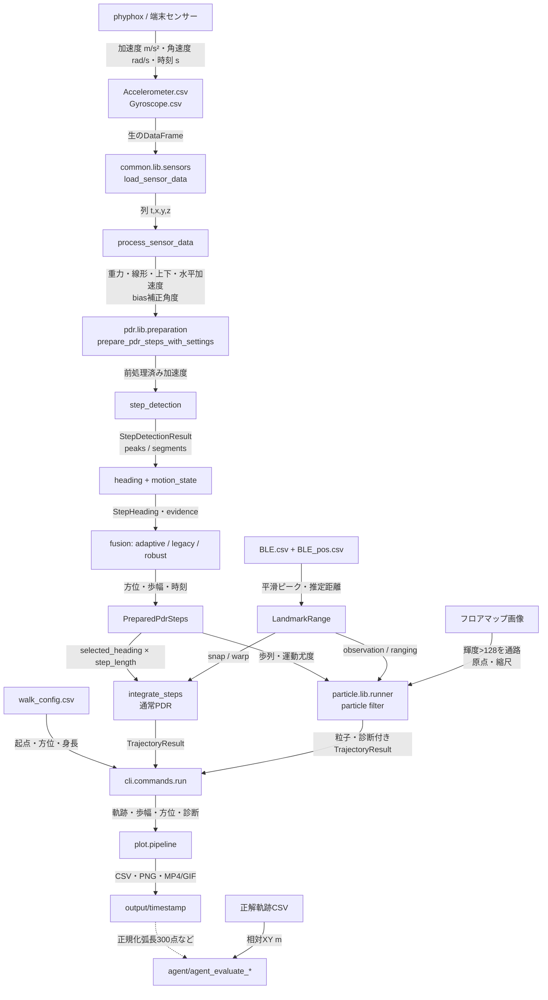
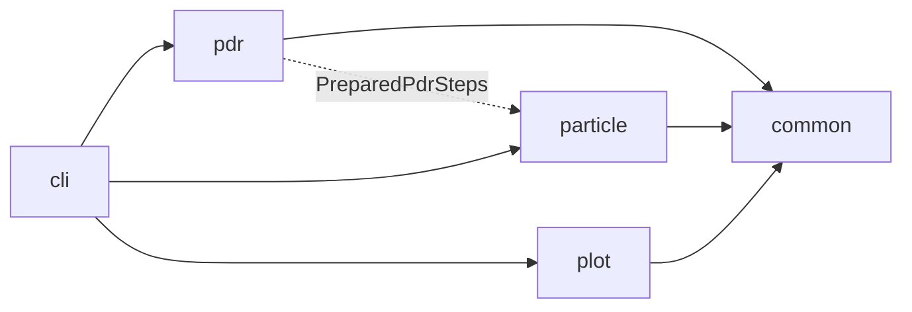

# システム全体のデータフロー

## 全体図

## 実コードにおける処理順

1. [`cli.options`](../../src/rikka/cli/options.py) が CLI 値を検証し、[`load_sensor_data()`](../../src/rikka/common/lib/sensors.py#L51) で2つの CSV を読みます。
2. [`cli.commands.run()`](../../src/rikka/cli/commands.py#L81) が [`PdrSettings`](../../src/rikka/common/settings.py#L218)、[`ParticleSettings`](../../src/rikka/common/settings.py#L166)、[`OutputSettings`](../../src/rikka/common/settings.py#L193) を作ります。
3. [`pdr.pipeline.run_pdr()`](../../src/rikka/pdr/pipeline.py#L21) が [`prepare_pdr_steps_with_settings()`](../../src/rikka/pdr/lib/preparation.py#L111) を呼びます。
4. 前処理、歩検出、方位・運動状態・歩幅推定を実行し、共有歩列を作ります。
5. 通常 PDR は [`integrate_steps()`](../../src/rikka/pdr/lib/integrate.py#L18) の結果を使用し、BLE有効時は `snap` または過去へ残差を配分する `warp` を適用します。
6. PF 指定時だけ [`particle.pipeline.run_particle()`](../../src/rikka/particle/pipeline.py#L28) が同じ共有歩列を補正し、`ranging` ではRSSI領域の尤度で祖先経路も再選択します。
7. [`plot.pipeline.write_outputs()`](../../src/rikka/plot/pipeline.py#L51) は常に CSV を保存し、`render()` は設定に応じて図・動画を保存します。
8. 評価は通常実行の必須工程ではなく、[`agent/`](../../agent) の明示実行で行います。

## センサー取得との境界

リポジトリ内に端末からリアルタイム取得する処理はありません。取得済み phyphox CSV が
入力境界です。`sensor` コマンドも取得は行わず、同じ CSV を前処理・歩検出して
`sensor_plot*.png` を入力フォルダへ保存します。

## モジュールの依存方向

実線が import 依存、破線が CLI を仲介したデータの流れです。`particle` は `pdr` の
内部関数を import せず、両者の境界は [`common.lib.models.PreparedPdrSteps`](../../src/rikka/common/lib/models.py#L230) だけです。
`plot` も推定側から呼ばれず、CLI が結果を渡します。

## 関連資料

- [実行開始から終了](02_entry-and-execution.md)
- [主要データ構造](03_data-structures.md)
- [保存・表示](19_output-and-visualization.md)
