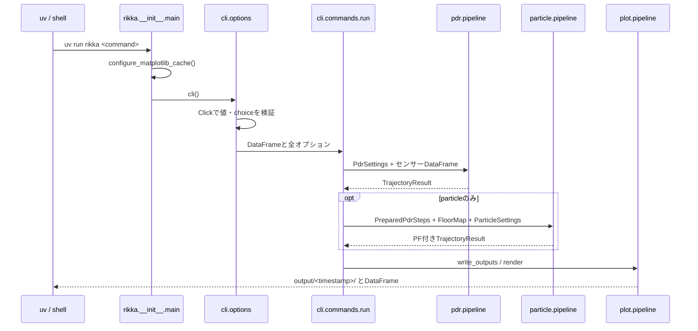

# 実行開始から終了

## 実行環境

| 項目 | 現在の内容 |
|---|---|
| Python | `>=3.14` |
| パッケージ管理 | `uv` |
| CLI登録 | `pyproject.toml`: `rikka = "rikka:main"` |
| lock | `uv.lock` format 1 / revision 3 |
| 主依存 | Click、NumPy、Pandas、SciPy、Matplotlib |
| 主要lock版 | click 8.3.3、numpy 2.4.3、pandas 3.0.1、scipy 1.17.1、matplotlib 3.10.8 |

## 実行コマンド

```sh
uv sync --all-groups
uv run rikka run
uv run rikka pdr                 # run の別名
uv run rikka particle --pf-seed 42
uv run rikka sensor -d <data-dir>
uv run rikka run --help
uv run rikka particle --help
```

バッチでは `--no-plot` を指定します。`--no-plot` が止めるのは図の表示・保存だけで、
CSV は通常 PDR / PF ともに常に保存されます。
PF の animation は、Python API では `save_animation` 既定が `plot` と同値、CLI の
`particle` では `--no-plot` を付けなければ保存されます。`--no-plot` と併用して動画だけ
残したい場合は `--save-animation` を明示します。

## エントリーポイント



## 初期化とデータ読み込み

1. [`rikka.__init__.main()`](../../src/rikka/__init__.py#L14) が Matplotlib cache を設定して Click を起動します。
2. [`cli.options._common_options()`](../../src/rikka/cli/options.py#L172) が共通引数を用意します。
3. `run` / `particle` は `common.lib.sensors.load_sensor_data(data_dir)` を呼びます。
4. [`cli.commands.run()`](../../src/rikka/cli/commands.py#L81) が不変設定 dataclass を構築し、PF時はフロアマップと原点を先に検証します。
5. Python API で DataFrame を渡す場合は、加速度・ジャイロを両方渡す必要があります。

## メイン処理

| 段階 | ファイル・関数 | 出力 |
|---|---|---|
| PDR入口 | [`pdr/pipeline.py::run_pdr()`](../../src/rikka/pdr/pipeline.py#L21) | [`TrajectoryResult`](../../src/rikka/common/lib/models.py#L280) |
| 共有歩列 | [`pdr/lib/preparation.py::prepare_pdr_steps_with_settings()`](../../src/rikka/pdr/lib/preparation.py#L111) | [`PreparedPdrSteps`](../../src/rikka/common/lib/models.py#L230) |
| PF入口 | [`particle/pipeline.py::run_particle()`](../../src/rikka/particle/pipeline.py#L28) | PF付き `TrajectoryResult` |
| PF低水準 | [`particle/lib/runner.py::run_particle_steps()`](../../src/rikka/particle/lib/runner.py#L74) | 軌跡、歩幅、時刻、全粒子、方位 |
| CSV保存 | [`plot/pipeline.py::write_outputs()`](../../src/rikka/plot/pipeline.py#L51) | 共通・方式固有CSV |
| 図・動画 | [`plot/pipeline.py::render()`](../../src/rikka/plot/pipeline.py#L128) | PNG、MP4またはGIF |

## CLIで切り替える主な実験条件

- 入力・地図: `-d`、`--floormap`、`--origin-px`、`--scale`
- PDR: `--step-detection`、`--step-length-method`、`--heading-method`
- bias: `--gyro-bias-method`、`--gyro-bias`
- 運動: `--motion-estimation`、`--smoothing`、横歩き関連オプション
- PF: `--pf-particles`、`--pf-seed`、`--motion-predictive-weight-power`、`--pf-path-selection`
- 出力: `--no-plot`、`--save-animation`、`--save-step-frames`、`--save-path-comparison`

全値と候補は [標準設定と切替](30_active-configurations.md) を参照してください。

## 評価との接続

CLI本体は正解軌跡を読みません。[`agent/agent_evaluate_adaptive_pdr.py`](../../agent/agent_evaluate_adaptive_pdr.py)、
[`agent_evaluate_pf_ground_truth.py`](../../agent/agent_evaluate_pf_ground_truth.py)、[`agent_benchmark_pdr_pf_methods.py`](../../agent/agent_benchmark_pdr_pf_methods.py) が、同じ
低水準関数を呼び、正解点列との正規化弧長比較を行います。
