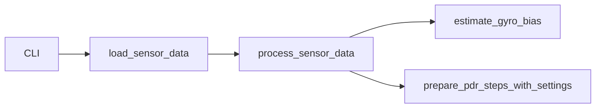

# 入力と前処理

## 1. この処理の役割

phyphox CSV を内部標準列へ揃え、方位・歩検出・歩幅推定が共用する信号を作ります。
重力ベクトルを移動平均で推定し、線形加速度を上下・水平へ分解します。同時にジャイロ
biasを推定し、補正角速度を積分して `angle` / `low_angle` を生成します。

## 2. 入力と出力

| 項目 | 内容 |
|---|---|
| 入力データ | `Accelerometer.csv`, `Gyroscope.csv` または2つのDataFrame |
| 入力元 | CLI `-d` / Python API |
| 出力データ | 標準列・解析列を追加した2つのDataFrame |
| 出力先 | [`prepare_pdr_steps_with_settings()`](../../src/rikka/pdr/lib/preparation.py#L111)、`sensor` 描画 |
| 主な型 | `pandas.DataFrame` |
| 単位 | 時刻s、加速度m/s²、角速度rad/s、角度rad |
| 座標系 | 入力XYZは端末座標、`v_acc`は重力軸、`h_*`は重力直交平面 |

## 3. 処理の流れ

1. CSV列を `t,x,y,z` にrenameし、XYZ必須列を検証します。
2. 加速度各軸を80サンプル中心移動平均し、`g=(gx,gy,gz)` を作ります。
3. `a_lin=a-g`、`lin_norm` とその移動平均を計算します。
4. `g_hat=g/max(|g|,1e-9)` を作り、上下・水平へ射影分解します。
5. 指定方式でジャイロx軸biasを推定します。
6. `gyro_rate=x-bias` を実時刻で積分し、40サンプル中心移動平均します。

## 4. 使用している計算・判定

- `v_acc = a_lin · g_hat`
- `a_horizontal = a_lin - (a_lin · g_hat) g_hat`
- `angle = cumsum(gyro_rate * dt)`。`t` 列があれば実時刻差、無ければ100Hz固定を使います。
  `t` 列があって欠損・非有限・非単調増加の場合は fallback せず `ValueError` で停止します。
- 標準 `prewalk_guarded` は歩行前robust推定値が `±0.003 rad/s` 内だけ採用します。
- `WINDOW_ACC=80`（0.8秒）、`WINDOW_GYRO=40`（0.4秒、いずれも100Hz想定）です。

## 5. 重要な関数

| 関数・クラス | ファイル | 役割 | 入力 | 出力 | 呼び出し元 |
|---|---|---|---|---|---|
| [`load_sensor_data`](../../src/rikka/common/lib/sensors.py#L51) | `common/lib/sensors.py` | CSV読込・列統一 | path | 2 DataFrame | CLI / PDR |
| [`process_sensor_data`](../../src/rikka/common/lib/sensors.py#L71) | 同上 | 信号分解・角度生成 | 2 DataFrame、bias設定 | 2 DataFrame | preparation |
| [`estimate_gyro_bias`](../../src/rikka/common/lib/gyro_bias.py#L229) | `common/lib/gyro_bias.py` | bias方式選択 | acc/gyro、方式 | `GyroBiasResult` | process |
| [`_gyro_integration_dt`](../../src/rikka/common/lib/time_utils.py#L40) | `common/lib/time_utils.py` | 積分刻み決定 | gyro DF | dt配列 | process |

## 6. 呼び出し関係

## 7. 現在の利用状態

- CSV読み込み・前処理: すべての標準ルートで使用。
- `prewalk_guarded`: 標準設定で使用。
- `zero/prewalk_robust/initial_robust/quietest/manual`: 設定変更時に使用。
- `sensor` コマンド: 推定本体とは別ルートだが、同じ前処理を可視化に使用。

## 8. 精度・評価結果

EXP-026の6計測比較では、従来prewalk推定そのままからguard付きへ変更した最終構成で、
PDR RMSE中央値/最大が `5.175/8.149 → 3.313/5.183 m`、PFが
`4.907/13.291 → 2.064/6.554 m`でした。他の変更も同時に含む最終構成比較のため、
bias guard単独の効果とは断定しません。

## 9. コードリード時の確認ポイント

- CSV列名の2系統と `t` が必須ではない点
- 中心移動平均のため、リアルタイム因果処理ではない前処理が含まれる点
- ジャイロは `x` 軸をyawとして使う点
- 0.003 rad/s guardとfallback理由
- 100Hz fallbackは「`t` 列が無い場合」だけで、壊れた `t` 列は例外になること
  （[`common/lib/time_utils.py::_time_values`](../../src/rikka/common/lib/time_utils.py#L22)）

## 10. 関連ファイル

- [`src/rikka/common/lib/sensors.py`](../../src/rikka/common/lib/sensors.py)
- [`src/rikka/common/lib/gyro_bias.py`](../../src/rikka/common/lib/gyro_bias.py)
- [`src/rikka/common/lib/gyro_bias_estimators.py`](../../src/rikka/common/lib/gyro_bias_estimators.py)
- [`src/rikka/common/lib/time_utils.py`](../../src/rikka/common/lib/time_utils.py)
