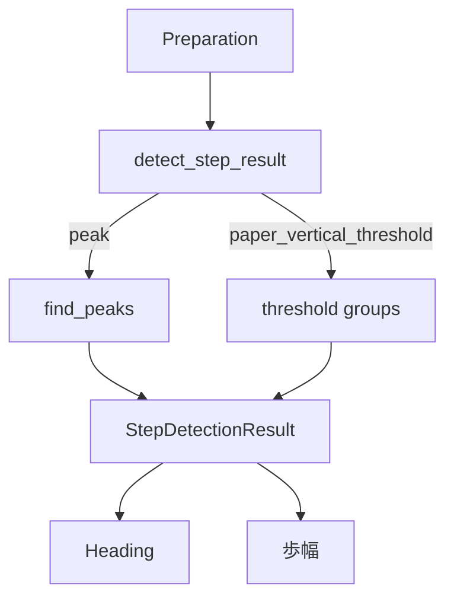

# 歩検出

## 1. この処理の役割

前処理済み加速度から歩行イベントを抽出し、後続の方位・歩幅推定に共通の歩順を
与えます。標準は線形加速度ノルムのピーク方式です。論文寄せの上下加速度閾値方式も
選べ、後者だけ明示的な1歩区間 [`StepSegment`](../../src/rikka/common/lib/models.py#L31) を返します。

## 2. 入力と出力

| 項目 | 内容 |
|---|---|
| 入力データ | 前処理済み加速度 |
| 入力元 | [`process_sensor_data()`](../../src/rikka/common/lib/sensors.py#L71) |
| 出力データ | [`StepDetectionResult`](../../src/rikka/common/lib/models.py#L39) |
| 出力先 | 方位・歩幅・保存・sensor plot |
| 主な型 | DataFrame、`np.ndarray`、`tuple[StepSegment,...]` |
| 単位 | 加速度m/s²、indexはsample番号 |
| 座標系 | peakは姿勢非依存ノルム、paper方式は重力軸射影 |

## 3. 処理の流れ

1. `detect_step_result()` が方式名を解決します。
2. `peak` は `low_lin_norm` をSciPy `find_peaks`へ渡します。
3. `paper_vertical_threshold` は `v_acc` を5サンプル平滑化します。
4. 正負の95/5 percentileを比べ、接地インパルスの極性を決めます。
5. 85 percentile以上の連続区間から最強点を接地候補にします。
6. 近接候補を抑制し、30〜80サンプルの隣接接地区間だけ残します。
7. 各区間の終端接地を `peaks` にします。区間の始点側は `peaks` に入りません。

## 4. 使用している計算・判定

| 方式 | 主な判定 |
|---|---|
| `peak` | `height=1.0 m/s²`, `distance=50 sample` |
| `paper_vertical_threshold` | 5点平滑化、85 percentile、接地間30〜80 sample |

標準100Hz換算で最短間隔は0.5秒、paper区間は0.3〜0.8秒です。設定値はサンプル数で
あり、入力の実サンプリング周期へ自動換算されない点に注意します。

## 5. 重要な関数

| 関数・クラス | ファイル | 役割 | 入力 | 出力 | 呼び出し元 |
|---|---|---|---|---|---|
| [`detect_step_result`](../../src/rikka/pdr/lib/step_detection.py#L166) | `pdr/lib/step_detection.py` | 方式分岐 | acc DF、method | 結果型 | preparation |
| [`_detect_steps_by_peak`](../../src/rikka/pdr/lib/step_detection.py#L32) | 同上 | 標準ピーク検出 | `low_lin_norm` | peaks | 上記 |
| [`_detect_steps_by_vertical_threshold`](../../src/rikka/pdr/lib/step_detection.py#L82) | 同上 | 区間抽出 | `v_acc` | peaks/segments | 上記 |
| [`_suppress_close_contacts`](../../src/rikka/pdr/lib/step_detection.py#L63) | 同上 | 近接重複抑制 | index/strength | 接地候補 | paper方式 |

## 6. 呼び出し関係

## 7. 現在の利用状態

- `peak`: 現在の標準設定で使用。
- `paper_vertical_threshold`: CLI設定変更時に使用。`step_segments.csv` も追加保存。
- [`detect_steps()`](../../src/rikka/pdr/lib/step_detection.py#L177): peaksだけを必要とする互換・検証用API。

## 8. 精度・評価結果

コード上は切り替え可能ですが、現行ログに両方式を同一データ・同一後段設定で比較した
歩数誤差または軌跡RMSEの確定表は確認できません。

## 9. コードリード時の確認ポイント

- `low_lin_norm` が80点平滑化済みであること
- 閾値がサンプルレート非依存ではないこと
- paper方式の極性決定とpercentile閾値
- paper方式の `peaks` は各区間の**終端**接地であり、最初の接地候補は `peaks` に含まれないこと
- `segments` の start/end/contact の意味（`contact_index` は `end_index` と同じ）

## 10. 関連ファイル

- [`src/rikka/pdr/lib/step_detection.py`](../../src/rikka/pdr/lib/step_detection.py)
- [`src/rikka/common/lib/models.py`](../../src/rikka/common/lib/models.py)
- [`tests/test_pdr_regressions.py`](../../tests/test_pdr_regressions.py)
