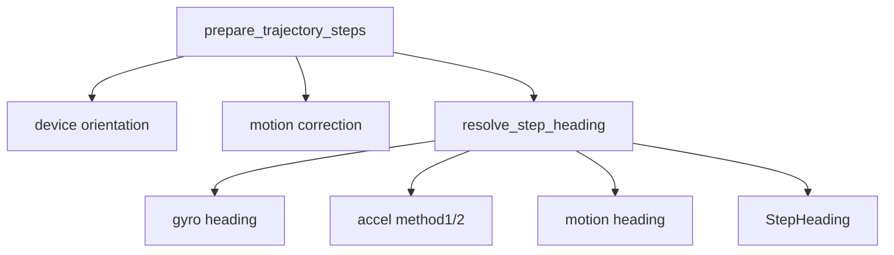

# 方位推定

## 1. この処理の役割

各歩についてジャイロ方位、2種類の加速度方位、水平加速度由来の移動方位を作り、
指定方式に従って候補を選びます。標準 `gyro_accel_motion` は端末・身体方向と移動方向を
別フィールドで保持し、後続の運動状態処理で使い分けます。

## 2. 入力と出力

| 項目 | 内容 |
|---|---|
| 入力データ | 前処理acc/gyro、歩ピーク/区間、初期方向 |
| 入力元 | [`prepare_trajectory_steps()`](../../src/rikka/pdr/lib/trajectory.py#L164) |
| 出力データ | 生の [`StepHeading`](../../src/rikka/common/lib/models.py#L49) 列 |
| 出力先 | motion refinement、fusion、PF |
| 主な型 | DataFrame、`StepHeading` |
| 単位 | 角度rad、初期方向CLIのみdeg、変位m相当 |
| 座標系 | 世界2D: 0=+X、反時計回り正 |

## 3. 処理の流れ

1. 初期8歩で4種類の端末水平軸向きを試し、前進らしさ最大を選びます。
2. 初期歩のbody/motion差を円平均し、`auto`補正角を求めます。
3. 各歩中点の `low_angle + initial_direction` をgyro/body headingにします。
4. 水平加速度の2ピークからaccel method1/2候補を作ります。
5. 水平加速度を各時刻のyawで世界座標へ回し、二重積分してmotion headingを作ります。
6. `heading_method` に応じて初期候補を選び、全候補を `StepHeading` に保持します。

## 4. 使用している計算・判定

- `world_x=h_y cosθ-h_z sinθ`, `world_y=h_y sinθ+h_z cosθ`
- 速度は両端0となる線形補正後に再積分します。
- motion confidenceは変位ノルム `1e-4 m` で飽和する比率です。
- 横優勢: `|lat| >= 0.03 m` かつ `|lat| >= 1.2*|forward|`。
- 旋回: 1歩yaw変化 `>=35°`。
- accel候補の信頼度はピーク強度、間隔、線長、区間長の積です。
- `gyro_accel_motion` の初期selectedはmotion confidence `>=0.6` ならmotion、なければgyro。
  ただし標準の後続処理はforward歩をbody headingへ戻します。

## 5. 重要な関数

| 関数・クラス | ファイル | 役割 | 入力 | 出力 | 呼び出し元 |
|---|---|---|---|---|---|
| [`resolve_step_heading`](../../src/rikka/pdr/lib/heading/resolver.py#L109) | `pdr/lib/heading/resolver.py` | 候補統合 | acc/gyro/歩 | `StepHeading` | trajectory |
| [`_estimate_motion_heading_from_horizontal_accel`](../../src/rikka/pdr/lib/heading/motion.py#L175) | `heading/motion.py` | 移動方位・変位 | 1歩信号 | motion result | resolver |
| [`_estimate_accel_headings`](../../src/rikka/pdr/lib/heading/accel.py#L81) | `heading/accel.py` | 2つの加速度候補 | 1歩信号 | accel result | resolver |
| [`estimate_device_orientation_mode`](../../src/rikka/pdr/lib/heading/device_orientation.py#L166) | `heading/device_orientation.py` | 端末軸向き選択 | 初期歩 | mode文字列 | trajectory |
| [`resolve_motion_heading_correction`](../../src/rikka/pdr/lib/heading/motion.py#L321) | `heading/motion.py` | 固定ずれ補正 | 初期歩 | rad | trajectory |

## 6. 呼び出し関係

## 7. 現在の利用状態

- `gyro_accel_motion`: 標準設定。body/motion分離に使用。
- `gyro`: 設定変更時。加速度候補は診断に残るが採用はgyro優先。
- `accel_method1/2`: 設定変更時。候補がない場合はgyroへfallback。
- motion correction `auto`: 標準。`none`で無効化可能。

## 8. 精度・評価結果

旧ログではbody/motion分離と区間処理を複合導入して複数データを改善していますが、
4つの `heading_method` だけを現行同一条件で比較した確定表はありません。robust方向復号は
[運動状態推定](13_motion-state-estimation.md) に記載します。

## 9. コードリード時の確認ポイント

- `selected_heading` がこの段階の最終値ではないこと
- gyro `x` 軸と初期方向offsetの対応
- 世界座標回転とzero-velocity補正
- `motion_heading_correction` の符号
- `forward_displacement` / `lateral_displacement` のbody軸射影
- 初期姿勢推定が2歩以上・観測の60%以上を要求する点

## 10. 関連ファイル

- [`src/rikka/pdr/lib/heading/resolver.py`](../../src/rikka/pdr/lib/heading/resolver.py)
- [`src/rikka/pdr/lib/heading/motion.py`](../../src/rikka/pdr/lib/heading/motion.py)
- [`src/rikka/pdr/lib/heading/accel.py`](../../src/rikka/pdr/lib/heading/accel.py)
- [`src/rikka/pdr/lib/heading/device_orientation.py`](../../src/rikka/pdr/lib/heading/device_orientation.py)
