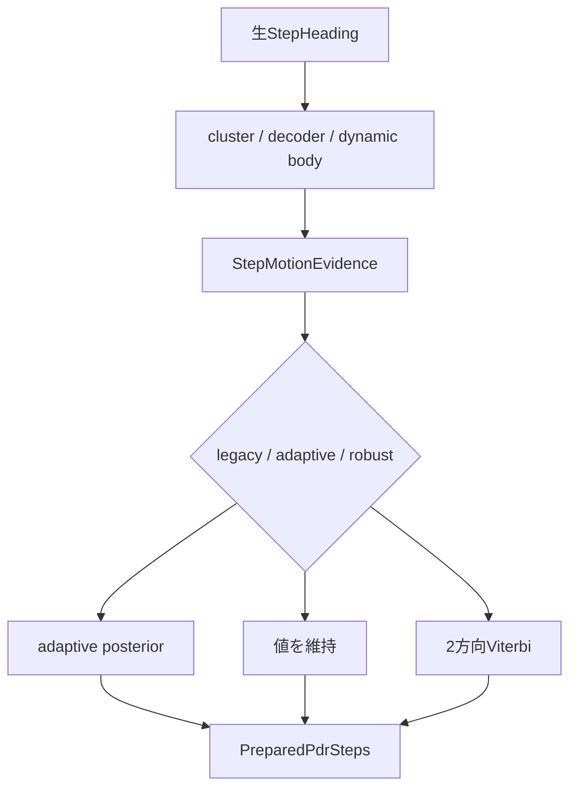

# 運動状態・方位融合

## 1. この処理の役割

歩ごとの生分類を区間として整え、forward・左右横歩き・turningの状態を推定します。
標準では横歩きクラスタと動的body headingを作った後、`adaptive + causal` が4状態確率、
方位、歩幅、端末―身体offsetを逐次更新します。

## 2. 入力と出力

| 項目 | 内容 |
|---|---|
| 入力データ | `StepHeading`、生歩幅、歩幅観測、motion evidence |
| 入力元 | heading・step length処理 |
| 出力データ | 確定heading/length、posterior、direction posterior |
| 出力先 | `PreparedPdrSteps`、軌跡積分、PF |
| 主な型 | `StepMotionEvidence`, `StepMotionPosterior` |
| 単位 | 方位rad、歩幅m、確率0〜1 |
| 座標系 | body方向、body左方向、世界方位を分離 |

## 3. 処理の流れ

`refine_step_headings_with_motion_model()` は、区間復号と横歩きクラスタリングを
「動的body heading推定」を挟んで2回実行します。

1. `build_step_motion_observations()` が、端末yaw・身体方位候補・方向未確定の移動軸を
   分離した観測列を作ります。
2. semi-Markov decoderが観測列を forward / 左右横歩きの区間へ復号します（1回目）。
3. 並行して既存のclusteringが、同方向の横歩きevidenceを最大1歩のgapを許してまとめます。
   evidence 2歩以上かつクラスタ横変位が十分なら横歩き確定、単発は標準でforward扱いです。
4. 2と3を突き合わせた保守的な状態列から、端末―身体offsetと動的body headingを推定します。
5. 新しいbody軸へ世界移動ベクトルを再射影し、復号とclusteringをもう一度かけて区間を確定します。
6. `build_step_motion_evidences()` が確定分類から4状態の観測尤度を作ります。
7. `MOTION_ESTIMATORS` が選んだ `adaptive` が、遷移事前×観測尤度×方位連続性で状態確率を
   更新し、歩幅scaleと端末―身体offsetをKalman型更新して混合平均の方位・歩幅を出します。

## 4. 使用している計算・判定

- adaptive遷移行列のstay確率: forward 0.91、左右横歩き0.86、turning 0.72。
- 方位連続性sigma: forward 24°、左右34°、turning 70°。
- 横歩き強evidence: body-motion差 `>=75°`、比率 `>=0.8`、横変位 `>=0.03m`。
- 同一分類の歩間方位上限: forward 25°、横歩き45°、turning横歩き90°。
- `offline` は全列後向き平滑化、`causal` はその歩までの観測です。
- `robust` は移動軸 `θ/θ+π` をViterbi復号し、135°反転には3歩60°yaw等の支持を要求します。

## 5. 重要な関数

| 関数・クラス | ファイル | 役割 | 入力 | 出力 | 呼び出し元 |
|---|---|---|---|---|---|
| `refine_step_headings_with_motion_model` | `motion_state/refinement.py` | 区間復号・body補正 | heading列 | heading列 | trajectory |
| `smooth_step_headings` | `motion_state/clustering.py` | clustered/isolated/none | heading列 | heading列 | refinement内で2回、`motion_refinement=False` 時はtrajectoryから直接 |
| `build_step_motion_evidences` | `motion_state/evidence.py` | 4状態尤度 | heading列 | evidence列 | preparation |
| `estimate_adaptive_pdr` | `fusion/adaptive.py` | 標準確率推定 | heading/length/evidence | result | protocol |
| `resolve_step_directions` | `fusion/robust.py` | 2方向Viterbi | heading/observation | 方位列 | protocol |
| `MOTION_ESTIMATORS` | `fusion/protocol.py` | 方式レジストリ | 設定名 | callable | preparation |

## 6. 呼び出し関係

## 7. 現在の利用状態

- `clustered`, `adaptive`, `causal`: 現在の標準設定で使用。
- `none`, `isolated`: 横歩き平滑化の比較時に使用。
- `legacy`: 既存補正済み値をそのまま返す比較方式。
- `robust`: 実験方式。コードとCLIから呼べるが標準ではない。
- `offline`: 全記録を使える評価・後処理向け設定。

## 8. 精度・評価結果

| 比較 | データ・条件 | 結果 | 情報源 |
|---|---|---|---|
| legacy→adaptive | 同一5記録、通常PDR | 全5記録でRMSE改善。例: 無印2.656→2.166m | EXP-018 |
| robust vs adaptive | 同一5記録、通常PDR | 最大7.838→7.390m、中央値3.622→5.352m | EXP-021 |
| causal+power0.1 | 5記録×6seed PF | power0から中央値4.933→4.052m、最大11.231→9.727m | EXP-020 |

robustは最大値を改善しましたが中央値を悪化させたため標準化されていません。

## 9. コードリード時の確認ポイント

- `movement_type` と `trajectory_movement_type` の差
- 復号とclusteringが、body軸の再射影を挟んで2回走る点
- 横歩きクラスタの2 evidence + 1 gap条件
- adaptiveがposteriorの `heading_mean` を最終方位へ入れる箇所
- causalでも前処理の中心移動平均は非因果である点
- robustの135°反転禁止と支持条件
- `legacy` は「古い別コード」ではなく値を変更しないadapterである点

## 10. 関連ファイル

- `src/rikka/pdr/lib/motion_state/`
- `src/rikka/pdr/lib/fusion/`
- `src/rikka/pdr/lib/preparation.py`
