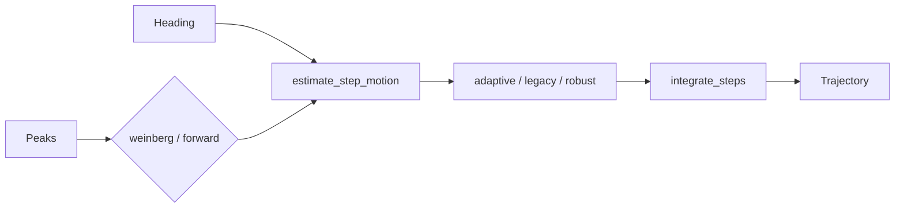

# 歩幅推定と軌跡生成

## 1. この処理の役割

各歩の距離を推定し、運動状態別倍率とfusion結果を反映した方位・歩幅を2次元座標へ
積算します。標準は身長補正したWeinberg式です。`integrate_steps()` が通常PDR軌跡を
作る唯一の積分実装です。

## 2. 入力と出力

| 項目 | 内容 |
|---|---|
| 入力データ | `v_acc`、水平加速度、歩ピーク、確定heading |
| 入力元 | 前処理・歩検出・motion fusion |
| 出力データ | 歩幅m、時刻s、`[[x,y],...]` |
| 出力先 | [`PreparedPdrSteps`](../../src/rikka/common/lib/models.py#L230)、PF、plot |
| 主な型 | list[float]、list[list[float]] |
| 単位 | m、s、rad |
| 座標系 | 原点開始、0rad=+X、反時計回り正 |

## 3. 処理の流れ

1. 身長からWeinberg係数 `K` を計算します。
2. 各ピーク±50sampleの `v_acc` 最大―最小からnominal歩幅を作ります。
3. 横歩き・旋回などの状態別倍率を反映します。
4. [`StepLengthObservation`](../../src/rikka/common/lib/models.py#L158) が接地区間ベースの候補、品質、不確かさを作ります。
5. adaptiveは状態別log scaleを更新し、posterior平均歩幅を確定します。
6. `integrate_steps()` が各歩をXYへ加算します。

## 4. 使用している計算・判定

- `K = 0.47 * height_m / 1.70`。標準身長1.68mでは約0.4645。
- Weinberg: `length = K*(max(v_acc)-min(v_acc))^0.25`。
- 状態別固定倍率の前段値: forward 1.0、横歩き0.8、turning 0.3、backward 1.0。
- `forward`方式: 水平加速度を前進軸へ射影して二重積分し、`K_FORWARD=9.0` を掛けます。
- 軌跡: `x'=x+l*cos(theta)`, `y'=y+l*sin(theta)`。
- 歩幅観測qualityはsample充足55% + 0.65秒近傍duration45%、fallback時0.65倍。

## 5. 重要な関数

| 関数・クラス | ファイル | 役割 | 入力 | 出力 | 呼び出し元 |
|---|---|---|---|---|---|
| [`estimate_step_length`](../../src/rikka/pdr/lib/step_length.py#L60) | `pdr/lib/step_length.py` | Weinberg歩幅 | acc/peak/K | m | trajectory |
| [`estimate_step_length_forward`](../../src/rikka/pdr/lib/step_length.py#L199) | 同上 | 射影積分歩幅 | acc/gyro/歩 | m | trajectory |
| [`build_step_length_observation`](../../src/rikka/pdr/lib/step_length.py#L79) | 同上 | 品質・不確かさ | 1歩区間 | observation | preparation |
| [`estimate_step_motion`](../../src/rikka/pdr/lib/motion_state/step_motion.py#L253) | `motion_state/step_motion.py` | 状態別方位・倍率 | heading/length | `StepMotion` | trajectory |
| [`integrate_steps`](../../src/rikka/pdr/lib/integrate.py#L18) | `pdr/lib/integrate.py` | XY積分 | heading/length列 | 軌跡 | preparation |

## 6. 呼び出し関係

## 7. 現在の利用状態

- `weinberg`: 標準設定で使用。
- `forward`: CLI設定変更時に使用。最後のpeakは次境界がなく除外されます。
- adaptive posterior歩幅: 標準 `adaptive` で使用。
- 固定0.8横歩き倍率: adaptiveのnominal観測にも前段で反映されます。

## 8. 精度・評価結果

EXP-016では横歩き倍率1.0→0.8で5つの通常PDR RMSEがすべて改善し、無印PFも
中央値/最大 `1.52/4.41 → 1.10/1.78m`でした。一方、反復5〜8の一部PF seedは
悪化しており、固定0.8は暫定採用・再検討扱いです。Weinberg対forwardの同一条件比較は
確認できません。

## 9. コードリード時の確認ポイント

- nominal歩幅とadaptive最終歩幅を区別すること
- Weinbergの±50sample窓とpaperの接地区間が異なること
- 状態倍率が適用される順序
- `forward`方式が最後の歩を除外すること
- 軌跡の先頭 `[0,0]` と出力時刻の対応

## 10. 関連ファイル

- [`src/rikka/pdr/lib/step_length.py`](../../src/rikka/pdr/lib/step_length.py)
- [`src/rikka/pdr/lib/motion_state/step_motion.py`](../../src/rikka/pdr/lib/motion_state/step_motion.py)
- [`src/rikka/pdr/lib/integrate.py`](../../src/rikka/pdr/lib/integrate.py)
- [`src/rikka/pdr/lib/fusion/adaptive.py`](../../src/rikka/pdr/lib/fusion/adaptive.py)
