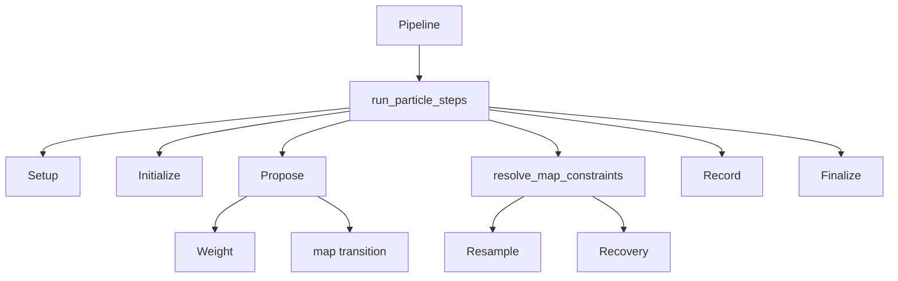

# Particle filter

## 1. この処理の役割

通常PDRで準備済みの歩列を粒子ごとに揺らし、フロアマップと運動状態尤度で重み付け
して地図上の代表軌跡を作ります。PDRのheading・歩幅を再推定せず、
`PreparedPdrSteps` を入力境界とします。

## 2. 入力と出力

| 項目 | 内容 |
|---|---|
| 入力データ | prepared heading/length/time/evidence/posterior、FloorMap |
| 入力元 | `particle.pipeline.run_particle()` |
| 出力データ | 代表軌跡、全粒子履歴、診断、任意stage/path比較 |
| 出力先 | `TrajectoryResult.particle`、plot |
| 主な型 | `ParticleRuntime`, NumPy配列 |
| 単位 | 位置m、方位rad、weight無次元 |
| 座標系 | 通常PDRと同じメートル座標 |

## 3. 処理の流れ

1. 設定値、prepared列の長さ、フロアマップと原点を検証します。
2. 500粒子を原点に置き、方位drift・歩幅倍率・一様重みを初期化します。
3. 各歩で方位driftを減衰＋ノイズで予測し、運動状態をsampleして状態別の基準方位を選び、
   歩幅倍率と1歩の歩幅を決めます。
4. 粒子位置を提案し、移動線分全体のmap有効性を判定します。
5. map、歩幅、tempered運動状態尤度で重みを更新します。
6. 必要ならrecovery、そうでなければESS判定でsystematic resamplingします。
7. 全時点の履歴からcurrent経路とsingle-ancestor sequenceを作り、guardで選びます。

## 4. 使用している計算・判定

- 初期heading sigma 0.03rad、歩ごと0.01rad、drift保持率0.85。
- 歩幅倍率事前平均1.03、初期sigma 0.05、保持0.995、範囲0.90〜1.15。
- 1歩ノイズ `PF_SIGMA_STEP_LENGTH_RATIO=0.01`。
- 重み: `prior * map_valid * stride_likelihood * state_likelihood^0.1`。
- `ESS=1/sum(w²)`、500粒子の50%未満で再標本化。
- 記録motion reliabilityが0.90〜0.92で、再標本化後headingノイズを0.009→0.004radへ線形縮小。
- `sequence` は未支持反転数がcurrentより厳密に少ない場合だけ採用します。

## 5. 重要な関数

| 関数・クラス | ファイル | 役割 | 入力 | 出力 | 呼び出し元 |
|---|---|---|---|---|---|
| `run_particle` | `particle/pipeline.py` | 共有型adapter | prepared/map/settings | result | CLI |
| `run_particle_steps` | `particle/lib/runner.py` | PFループ | 42個の位置引数 | 低水準tuple | pipeline |
| `ParticleRuntime` | `particle/lib/state.py` | 型付き実行状態 | 設定/歩列 | mutable context | runner |
| `propose` | `particle/lib/propose.py` | 状態・位置提案と重み | runtime | runtime更新 | runner |
| `resolve_map_constraints` | `particle/lib/evaluate_map.py` | 復旧/再標本化 | runtime | runtime更新 | runner |
| `finalize` | `particle/lib/finalize.py` | 代表経路選択 | 履歴 | 最終tuple | runner |

## 6. 呼び出し関係

## 7. 現在の利用状態

- PF自体: `rikka particle` またはPython APIで明示した時だけ使用。
- 500粒子、power 0.1、path `sequence`: PFの標準設定。
- path `current`: 切替可能。
- recovery branch quota `preserve_recovery_branches`: 低水準実験用、既定false、CLI非公開。
- stage/path collector: 保存オプション指定時だけ有効。

## 8. 精度・評価結果

EXP-026の6計測×6seed最終構成はRMSE中央値/最大 `2.064/6.554m`、壁交差0、
recovery failure 0、終端方向failure 0でした。EXP-029以降の無印データ6seedでは
`1.428/2.452m` で、到達可能クラスタ導入前 `1.221/2.427m` より小幅悪化しています。

## 9. コードリード時の確認ポイント

- PDR内部を呼ばずprepared列だけを使う境界
- `heading_correction` と減衰する `heading_drift` の違い
- motion posterior不確かさがprocess sigma/stride範囲を広げる条件
- map invalidでweightが0になる順序
- ESS後のノイズが記録単位reliabilityで変わる点
- `sequence` 設定でも実際のselected modeがcurrentになり得る点

## 10. 関連ファイル

- `src/rikka/particle/pipeline.py`
- `src/rikka/particle/lib/runner.py`
- `src/rikka/particle/lib/state.py`
- `src/rikka/particle/lib/propose.py`
- `src/rikka/particle/lib/finalize.py`
