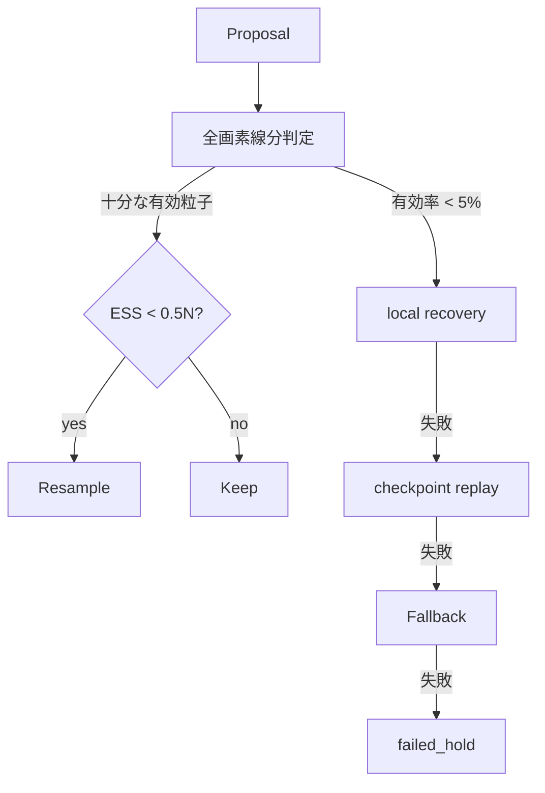

# マップ制約・再標本化・復旧

## 1. この処理の役割

PFの各提案移動が通路内に収まるかをフロアマップ全画素で判定します。有効粒子が不足
した場合は、局所候補、checkpoint replay、広域fallback、直前位置保持の順で復旧します。
最終経路も壁を横切らない候補だけから構成します。

## 2. 入力と出力

| 項目 | 内容 |
|---|---|
| 入力データ | 前後粒子位置、画像、原点、縮尺、方位/歩幅状態 |
| 入力元 | PF propose / finalize |
| 出力データ | valid mask、復旧粒子、親index、代表経路 |
| 出力先 | PF重み・履歴・診断 |
| 主な型 | `(N,2)` array、2D gray array、bool array |
| 単位 | meter / pixel |
| 座標系 | [`compute_pixel_coords()`](../../src/rikka/common/lib/floormap.py#L23) で画像座標へ変換 |

## 3. 処理の流れ

1. RGB画像を先頭3ch平均でgray化し、0〜255へ正規化します。
2. 原点がgray `>128` の通路画素か検証します。
3. 各粒子の始点・終点をpixelへ変換します。
4. supercover方式で線分が触れる全画素を検査します。
5. 正の重みを持つ有効粒子率が5%未満ならrecoveryへ進みます。
6. 局所候補→直近3歩内checkpoint replay→fallbackを試します。
7. 全失敗時は直前位置を保持し、`failed_hold` を診断します。

## 4. 使用している計算・判定

- 通路: `map_gray > 128`。マップ外は壁扱い。
- pixel: `px=origin_x+x/scale`, `py=origin_y+y_sign*y/scale`。
- pixel角を横切る場合は隣接2画素も通路であることを要求します。
- recovery開始: `valid_weight_count/N < 0.05` または有効weight mass 0。
- local recovery heading sigma 0.08rad、最大試行設定5（通常実装は最大2段）。
- checkpoint候補は完了歩との差が1〜3歩の健全状態です。
- recovery後は一様重みへ戻し、map回避角は永続校正ではなくdriftとして保持します。

## 5. 重要な関数

| 関数・クラス | ファイル | 役割 | 入力 | 出力 | 呼び出し元 |
|---|---|---|---|---|---|
| [`_evaluate_particle_transitions`](../../src/rikka/particle/lib/map_constraints.py#L127) | `particle/lib/map_constraints.py` | 全粒子線分判定 | 前後位置/map | bool列 | propose/finalize |
| [`_segment_crosses_only_walkable_cells`](../../src/rikka/particle/lib/map_constraints.py#L69) | 同上 | 1線分supercover | pixel線分 | bool | 上記 |
| [`resolve_map_constraints`](../../src/rikka/particle/lib/evaluate_map.py#L98) | `particle/lib/evaluate_map.py` | 復旧順制御 | runtime | runtime更新 | runner |
| [`_generate_recovery_candidates`](../../src/rikka/particle/lib/recovery/local.py#L72) | `recovery/local.py` | 局所候補生成 | 状態/map | recovery | apply |
| [`_replay_from_checkpoint`](../../src/rikka/particle/lib/recovery/checkpoint.py#L191) | `recovery/checkpoint.py` | 複数歩再生 | checkpoint/歩列 | replay result | apply |
| [`_select_reachable_cluster_path`](../../src/rikka/particle/lib/path_selection.py#L21) | `path_selection.py` | current経路 | 履歴/map | path/mode/source | finalize |

## 6. 呼び出し関係

## 7. 現在の利用状態

- 全画素壁判定、ESS再標本化、recovery順: PF実行時に標準使用。
- checkpoint replay: 条件成立時のみ使用。
- branch preserving recovery: 実験機能、既定無効。
- [`_snap_trajectory_to_walkable_pixels`](../../src/rikka/particle/lib/map_constraints.py#L170): 実装はあるが、現行PF主経路からの呼び出し元は見つかりません。

## 8. 精度・評価結果

現行安全性ベースラインでは複数seedで壁交差・recovery failureが0です。一方EXP-027は、
これらが0でもrecovery角が約13歩残り、seed間RMSEが0.784〜2.427mへ広がる例を記録
しています。安全性合格と形状精度は同一ではありません。

## 9. コードリード時の確認ポイント

- gray閾値128とマップ画像の意味
- 端点だけでなく線分全画素を検査すること
- pixel Y符号を重力主成分から決めること
- recovery順と `failed_hold` の副作用
- replay時に過去の履歴・診断を置換する箇所
- recovery後ESSがNへ戻るため「高品質」を意味しない点

## 10. 関連ファイル

- [`src/rikka/particle/lib/map_constraints.py`](../../src/rikka/particle/lib/map_constraints.py)
- [`src/rikka/particle/lib/evaluate_map.py`](../../src/rikka/particle/lib/evaluate_map.py)
- [`src/rikka/particle/lib/recovery/`](../../src/rikka/particle/lib/recovery)
- [`src/rikka/particle/lib/path_selection.py`](../../src/rikka/particle/lib/path_selection.py)
