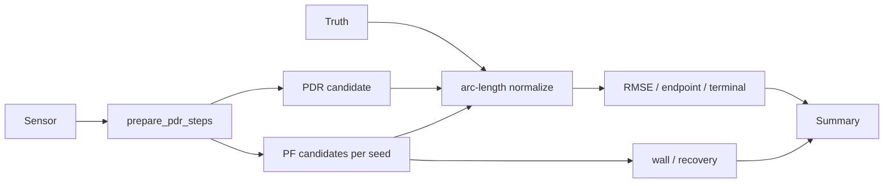

# 評価処理

## 1. この処理の役割

通常実行とは別に、正解軌跡と推定軌跡を同じ弧長位置で比較し、PDR方式・PF seed・
地図安全性を評価します。センサーと正解の時刻や歩数が同期していないため、行番号や
時刻の直接対応は使用しません。

## 2. 入力と出力

| 項目 | 内容 |
|---|---|
| 入力データ | センサーCSV、正解XY CSV、map、方式、seed |
| 入力元 | `input/` とCLI引数 |
| 出力データ | JSON/CSV、任意比較PNG、候補軌跡 |
| 出力先 | stdout、指定path、diagnostics |
| 主な型 | NumPy、Pandas、dict |
| 単位 | 誤差m、方向deg、時間s |
| 座標系 | 開始点を0へ移したメートル座標 |

## 3. 処理の流れ

1. 正解点列を読み、開始点を引きます。
2. PDR/PFを指定条件で実行します。
3. 推定・正解を累積弧長0〜1の300点へ補間します。
4. 対応点距離からarc RMSEを計算します。
5. 終点誤差、距離、終端15%の方向を計算します。
6. PFでは全遷移の壁判定、recovery failure、spread等も集計します。
7. 複数seed/方式は中央値、最大、seed標準偏差をまとめます。

## 4. 使用している計算・判定

- `arc_rmse = sqrt(mean(||p_i-truth_i||²))`、正規化弧長300点。
- endpoint errorは元軌跡終点間のユークリッド距離。
- 終端方向は最後15%の代表headingを比較します。
- `terminal_direction_failure`: 正解方向への投影が負、または逆向き割合0.5以上。
- PFの回帰は同じseedで再現性、複数seedで安定性を見ます。

## 5. 重要な関数

| 関数・クラス | ファイル | 役割 | 入力 | 出力 | 呼び出し元 |
|---|---|---|---|---|---|
| `_trajectory_metrics` | `agent_benchmark_pdr_pf_methods.py` | 横断指標 | trajectory/truth | dict | main |
| `_sample_by_arclength` | 各評価script | 300点補間 | XY | XY | metrics |
| `evaluate_terminal_direction` | `common/lib/trajectory_direction.py` | 終端方向指標 | 2軌跡 | metrics | agent scripts |
| `_evaluate_pf` | benchmark script | PF実行・安全性 | prepared/seed | row | main |
| `_select_medoid` | `agent_build_consensus_trajectory.py` | 代表候補 | 候補群 | index | main |

## 6. 呼び出し関係

## 7. 現在の利用状態

- 評価処理は通常CLIから自動実行されず、`agent/agent_*.py` の明示実行です。
- `agent_benchmark_pdr_pf_methods.py`: PDR/PF・複数記録・複数seed横断。
- `agent_evaluate_pf_ground_truth.py`: 1記録のPF複数seed。
- `agent_evaluate_adaptive_pdr.py`: PDR方式比較。
- consensus/heading reversal scripts: 候補群診断・代表選択。

## 8. 精度・評価結果

比較表は [精度比較](31_accuracy-comparison.md) に集約します。現行コードに最も近い
固定seed安全性はEXP-029/030のRMSE中央値/最大 `1.428/2.452m`、6seedすべてで
壁交差・recovery failure・終端方向failure 0です。

## 9. コードリード時の確認ポイント

- 正規化弧長が時間・歩番号対応ではないこと
- 同じルートの反復計測だけを同じtruthへ比較する前提
- RMSE、終点誤差、終端方向を併用する理由
- 1 seedの結果でPF方式を決めないこと
- 古いログと現行コードの条件差

## 10. 関連ファイル

- `agent/agent_benchmark_pdr_pf_methods.py`
- `agent/agent_evaluate_pf_ground_truth.py`
- `agent/agent_evaluate_adaptive_pdr.py`
- `src/rikka/common/lib/trajectory_direction.py`
- `agent/EXPERIMENT_LOG.md`
