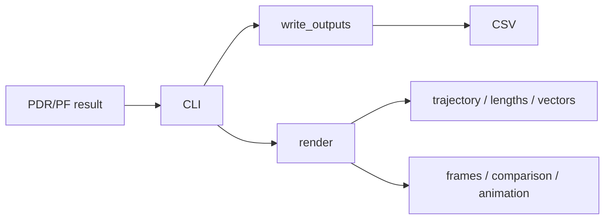

# 保存・表示

## 1. この処理の役割

推定領域から受け取った `TrajectoryResult` をCSV、静止画、動画へ変換します。推定本体は
保存処理を呼ばず、`cli.commands.run()` が `plot.pipeline` へ結果を渡す構造です。
通常PDRとPFの共通成果物を一か所で管理します。

## 2. 入力と出力

| 項目 | 内容 |
|---|---|
| 入力データ | `TrajectoryResult` と3種のsettings |
| 入力元 | `cli.commands.run()` |
| 出力データ | CSV、PNG、MP4/GIF、console summary |
| 出力先 | `output/<timestamp>/`、sensor図のみ入力dir |
| 主な型 | DataFrame、Matplotlib figure、NumPy |
| 単位 | CSVごとにm/s/rad→deg変換 |
| 座標系 | 軌跡mをmap pixelへ変換 |

## 3. 処理の流れ

1. `_create_output_dir()` がmicrosecond付き時刻dirを作ります。
2. `write_outputs()` が共通CSVを常に保存します。
3. adaptive/robust/PF時だけ対応診断CSVを追加します。
4. `plot=True` なら軌跡、歩幅、歩ベクトル図を保存・表示します。
5. PFでは設定に応じてstage画像、経路比較、animationを保存します。
6. ffmpeg利用不可時はGIFへfallbackします。

## 4. 使用している計算・判定

- headingの内部radはCSVでdegへ変換します。
- `trajectory.csv` は原点行を含まず1行=1歩です。`timestamp_s` は1歩目の時刻を0とした相対時刻で、
  推定軌跡の点数より1行少なくなります。
- 通常/PFで軌跡plotterを切替えます。
- `--no-plot` は通常図を止めますがCSV保存を止めません。
- PF animationはCLI `particle` でplot有効時は標準保存です。
- stage画像・path比較は既定無効で、明示指定時だけ配列copyを収集します。

## 5. 重要な関数

| 関数・クラス | ファイル | 役割 | 入力 | 出力 | 呼び出し元 |
|---|---|---|---|---|---|
| `create_output_dir` | `plot/pipeline.py` | 保存先作成 | なし | Path | CLI |
| `write_outputs` | 同上 | CSV一式 | result/path | DataFrame | CLI |
| `render` | 同上 | 図・PF成果物分岐 | result/settings | なし | CLI |
| `_build_step_headings_dataframe` | `plot/lib/outputs.py` | heading診断表 | StepHeading列 | DataFrame | write |
| `save_particle_animation` | `plot/lib/animation.py` | MP4/GIF | 粒子履歴 | file | render |
| `save_particle_step_frames` | `plot/lib/frames.py` | 段階別画像 | stage/diagnostics | paths | render |

## 6. 呼び出し関係

## 7. 現在の利用状態

- 共通CSV: `run` / `particle` で常に使用。
- 通常図: plot有効時に使用。
- PF animation: PFの標準対話実行で使用、`--no-plot`時は`--save-animation`で明示。
- stage画像/path比較: 診断実験でのみ使用、既定無効。
- `sensor_plot*.png`: `sensor` コマンドで入力フォルダへ保存。

## 8. 精度・評価結果

保存・表示自体の精度比較は該当しません。EXP-028では可視化collector有無で固定seedの
軌跡、粒子、歩幅、方位、診断が完全一致し、可視化が推定を変えないことを確認しています。

## 9. コードリード時の確認ポイント

- 推定からplotへの依存がなく、CLIが接続する点
- CSVがplotフラグに関係なく保存される点
- 条件付きCSVの生成条件
- `movement_type` と `trajectory_movement_type` の両方を保存する理由
- animationのMP4/GIF fallback
- 大容量stage画像が既定無効であること

## 10. 関連ファイル

- `src/rikka/plot/pipeline.py`
- `src/rikka/plot/lib/outputs.py`
- `src/rikka/plot/lib/animation.py`
- `src/rikka/plot/lib/frames.py`
- `src/rikka/plot/lib/sensor.py`
